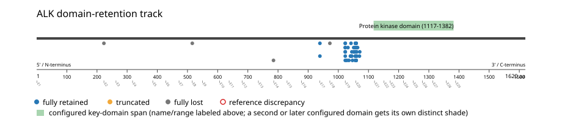
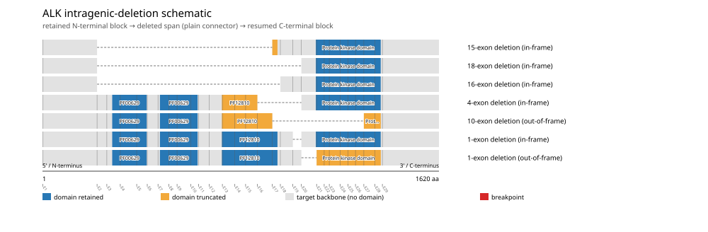

# ALK real-data fusion benchmark: msk_impact_50k_2026

Retrieved from public cBioPortal and Genome Nexus on 2026-09-15.

## Results

- Structural variants returned for ALK: 322
- Protein-fusion records found: 272
- Protein-fusion records mapped: 271
- Malformed/unmappable fusion records skipped: 1
- In-frame among known-frame events: 226/232 (97.4%)
- Unknown frame status: 39/271
- Protein kinase domain (1117-1382 aa) retained: 261/271 (96.3%)
- In-frame and Protein kinase domain-retained: 222/226
- Fisher exact test (one-sided): odds ratio 8.53846, p=0.00191661
- Breakpoint-permutation empirical p-value: 0.000999001
- Contingency table `[[retained/in-frame, retained/other], [not-retained/in-frame, not-retained/other]]`: `[[222, 39], [4, 6]]`

The Protein kinase domain appears to be required for retention.

- Mutation/CNA co-occurrence: not computed (ALK has no mutual_exclusivity_targets configured; co-occurrence/mutual-exclusivity analysis was skipped.)

### Mechanistic interpretation

**Curated mechanism:** Partner-driven constitutive oligomerization, not domain loss per se: loss of ALK's extracellular ligand-binding region is permissive (it removes the requirement for ALKAL1/ALKAL2 and untethers the kinase from the membrane) but not by itself activating -- an isolated ALK intracellular domain held in the monomeric state is not transforming. The partner's N-terminal self-association domain (e.g. EML4's trimerization domain, historically described as a coiled-coil, in EML4-ALK) is the necessary activating event: it forces ligand-independent self-association and trans-autophosphorylation of the ALK kinase domain, independent of any ligand. Ectopic promoter-driven expression in a tissue where ALK is normally silent contributes but is not itself the activating step.

**Protein kinase domain retention:** statistically supported (p=0.00191661, odds ratio=8.53846), but 4/226 in-frame events (1.8%) show the opposite status.

EML4 (x2) recur among just these counter-intuitive events -- a candidate subgroup that may follow a distinct, not-yet-curated mechanism. This is flagged for manual curator review, not asserted as a confirmed alternate mechanism.

| Event | Sample | Partner | Breakpoint (aa) | Status |
|---|---|---|---:|---|
| EVT-P-0002266-T01-IM3-141 | P-0002266-T01-IM3 | EML4 | 1058 | lost |
| EVT-P-0026650-T02-IM6-159 | P-0026650-T02-IM6 | EML4 | 1058 | lost |
| EVT-P-0018541-T01-IM6-174 | P-0018541-T01-IM6 | LRP1B | 972 | lost |
| EVT-P-0068865-T02-IM7-178 | P-0068865-T02-IM7 | RANBP2 | 1058 | lost |

### Domain retention and discrepancies

*Domain-retention positions for analyzed fusion events; red outlines mark reference discrepancies.*

### Fusion-transcript schematic

*One row per recurrent partner/breakpoint group, sharing one amino-acid x-axis for ALK's full protein length; the partner-contributed portion is colored per partner, the retained target-gene portion is colored by domain-retention status, and a red line marks the breakpoint.*

### Intragenic-deletion schematic

*Same-gene (Site1==Site2==ALK) intragenic-deletion-style SV records: a retained N-terminal block, a plain connector line for the deleted span, and a resumed C-terminal block.*

## Method

The cBioPortal `msk_impact_50k_2026_structural_variants` structural-variant profile was queried by the configured Entrez gene ID. Fusion-annotated records were adapted to the production SV schema and normalized; when `site2EffectOnFrame=NA`, frame status was resolved from `Event_Info`, not copied into `FusionEvent.Frame_status`.

ALK genomic breakpoints were mapped against the Genome Nexus canonical transcript, and retention was classified against its returned Protein kinase domain coordinates. Counts are event-level with no patient deduplication. In-frame percentage uses only events explicitly called in-frame or out-of-frame; unknown-frame events are reported separately and excluded from that denominator. The Fisher comparison's `other` column combines out-of-frame and unknown-frame events, as pre-specified by the domain-retention algorithm.

For each fusion, breakpoint selection preferred the Genome Nexus canonical transcript's exon-spanned target locus over cBioPortal site labels; malformed rows with no unambiguous target-locus coordinate were skipped and listed in Warnings.

## Full-suite highlights

- Registered algorithms executed: composite_score, confidence_stats, cutpoint_detection, domain_disruption, domain_retention, exon_retention, expression_association, frequency, genomic_position_recurrence, joint_partner, mechanistic_interpretation, mutation_cooccurrence, window_detection
- Cutpoint detection: inferred breakpoint 972 aa (exon 17/18 boundary); corrected permutation p=0.000999001.
- Genomic-position recurrence: The 238 events sharing protein position 1058 aa use 184 distinct genomic positions spanning 1913 bp -- the protein-position recurrence is broader than any single genomic hotspot, consistent with independent intronic breakpoints mapped (or clamped) onto the same protein/exon boundary rather than one shared DNA lesion.
- Top composite score: EML4 (221 events), 0.650354.
- Expression association: No mRNA expression data was available for ALK in this cohort; expression-association analysis was skipped.

## Partners

ASAP2 (1), CLTC (2), CTNNA1 (1), CTSE (1), DCTN1 (1), DIAPH2 (1), DYSF (1), EMILIN1 (1), EML4 (221), FN1 (1), GCC2 (1), H6PD (1), HMBOX1 (1), KIF5B (5), LRP1B (1), NOTCH1 (1), NRP2 (1), PICALM (3), PLEKHA7 (1), PLEKHH2 (1), PPP1CB (1), RANBP2 (3), SOS1 (1), SPTBN1 (4), SQSTM1 (2), STRN (7), TFG (1), TPM1 (2), TRAF3 (1), TTC27 (1), VCL (1), ZFPM2 (1)

## Warnings

- Skipped EVT-P-0055607-T02-IM6-180 (ALK-SOS1): ValueError: could not determine 5'/3' role for ALK in EVT-P-0055607-T02-IM6-180; Event_Info='Antisense Fusion'

## Interpretation

EML4 is the recurrent partner (221/272 events), and PF07714 retention is 96.3%. These directions are consistent with the well-known EML4-ALK fusion pattern; this is a cohort-specific live measurement, not a comparison forced to a literature value.
