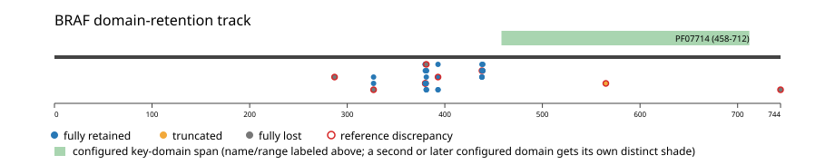
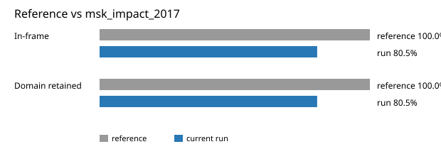

# BRAF real-data fusion benchmark: msk_impact_2017

Retrieved from public cBioPortal and Genome Nexus on 2026-09-04.

## Results

- Structural variants returned for BRAF: 48
- Protein-fusion records found: 41
- Protein-fusion records mapped: 40
- Malformed/unmappable fusion records skipped: 1
- In-frame: 33/41 (80.5%)
- PF07714 (458-712 aa) retained: 33/41 (80.5%)
- In-frame and PF07714-retained: 31/33
- Fisher exact test (one-sided): odds ratio 38.75, p=0.00060718
- Breakpoint-permutation empirical p-value: 0.000999001
- Contingency table `[[retained/in-frame, retained/other], [not-retained/in-frame, not-retained/other]]`: `[[31, 2], [2, 5]]`

### Domain retention and discrepancies

*Domain-retention positions for analyzed fusion events; red outlines mark reference discrepancies.*

## Method

The cBioPortal `msk_impact_2017_structural_variants` structural-variant profile was queried by the configured Entrez gene ID. Fusion-annotated records were adapted to the production SV schema and normalized; when `site2EffectOnFrame=NA`, frame status was resolved from `Event_Info`, not copied into `FusionEvent.Frame_status`.

BRAF genomic breakpoints were mapped against the Genome Nexus canonical transcript, and retention was classified against its returned PF07714 coordinates. Counts are event-level with no patient deduplication. The Fisher comparison's `other` column combines out-of-frame and unknown-frame events, as pre-specified by the domain-retention algorithm.

For each fusion, breakpoint selection preferred the Genome Nexus canonical transcript's exon-spanned target locus over cBioPortal site labels; malformed rows with no unambiguous target-locus coordinate were skipped and listed in Warnings.

## Full-suite highlights

- Registered algorithms executed: composite_score, confidence_stats, cutpoint_detection, domain_disruption, domain_retention, exon_retention, frequency, joint_partner
- Cutpoint detection: inferred breakpoint 439 aa; corrected permutation p=0.0599401.
- Top composite score: SND1 (8 events), 0.310496.

## Partners

AGAP3 (2), AGK (3), CCDC6 (1), CDK5RAP2 (2), CUL1 (1), FAM131B (1), GIPC2 (1), KDM7A (1), KIAA1549 (4), LINC00244 (1), LUC7L2 (1), METTL2B (1), MKRN1 (3), MRPS33 (1), OSBPL9 (1), PARP12 (1), PHTF2 (1), PJA2 (1), PRKAR1B (1), PRKAR2B (1), RBM33 (1), SCRIB (1), SND1 (8), VIPR2 (1), ZNF207 (1)

## Warnings

- Skipped EVT-P-0010083-T01-IM5-35 (PARP12-BRAF): ValueError: BRAF fusion has no site breakpoint within target locus 140434279-140624564: Site1=-1, Site2=-1

## Reference comparison

| Metric | PMC5461196 | This run |
|---|---:|---:|
| In-frame | 100.0% | 80.5% |
| Domain retained | 100.0% | 80.5% |

*Published reference percentages compared with this run.*

## Interpretation

These values describe the live study named above.
