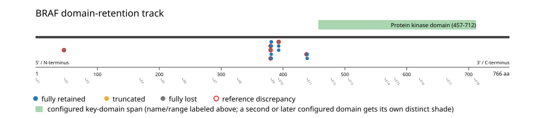
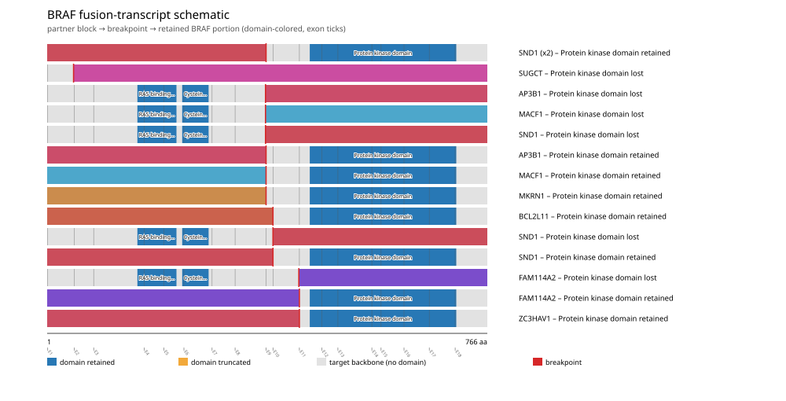
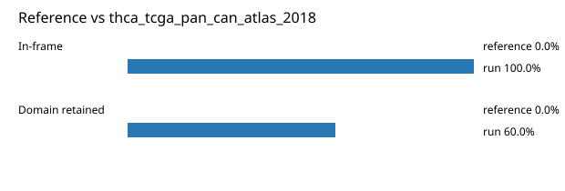

# BRAF real-data fusion benchmark: thca_tcga_pan_can_atlas_2018

Retrieved from public cBioPortal and Genome Nexus on 2026-09-05.

## Results

- Structural variants returned for BRAF: 15
- Protein-fusion records found: 15
- Protein-fusion records mapped: 15
- Malformed/unmappable fusion records skipped: 0
- In-frame: 15/15 (100.0%)
- PF07714 (457-712 aa) retained: 9/15 (60.0%)
- In-frame and PF07714-retained: 9/15
- Fisher exact test (one-sided): odds ratio unavailable, p=1
- Breakpoint-permutation empirical p-value: 0.015984
- Contingency table `[[retained/in-frame, retained/other], [not-retained/in-frame, not-retained/other]]`: `[[9, 0], [6, 0]]`

### Domain retention and discrepancies

*Domain-retention positions for analyzed fusion events; red outlines mark reference discrepancies.*

### Fusion-transcript schematic

*One row per recurrent partner/breakpoint group, sharing one amino-acid x-axis for BRAF's full protein length; the partner-contributed portion is colored per partner, the retained target-gene portion is colored by domain-retention status, and a red line marks the breakpoint.*

## Method

The cBioPortal `thca_tcga_pan_can_atlas_2018_structural_variants` structural-variant profile was queried by the configured Entrez gene ID. Fusion-annotated records were adapted to the production SV schema and normalized; when `site2EffectOnFrame=NA`, frame status was resolved from `Event_Info`, not copied into `FusionEvent.Frame_status`.

BRAF genomic breakpoints were mapped against the Genome Nexus canonical transcript, and retention was classified against its returned PF07714 coordinates. Counts are event-level with no patient deduplication. The Fisher comparison's `other` column combines out-of-frame and unknown-frame events, as pre-specified by the domain-retention algorithm.

For each fusion, breakpoint selection preferred the Genome Nexus canonical transcript's exon-spanned target locus over cBioPortal site labels; malformed rows with no unambiguous target-locus coordinate were skipped and listed in Warnings.

## Full-suite highlights

- Registered algorithms executed: domain_retention, frequency

## Partners

AP3B1 (2), BCL2L11 (1), FAM114A2 (2), MACF1 (2), MKRN1 (1), SND1 (5), SUGCT (1), ZC3HAV1 (1)

## Reference comparison

| Metric | PMC5461196 | This run |
|---|---:|---:|
| In-frame | 100.0% | 100.0% |
| Domain retained | 100.0% | 60.0% |

*Published reference percentages compared with this run.*

## Interpretation

These values describe the live study named above.
