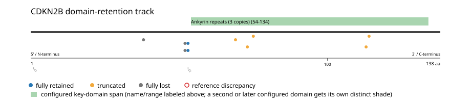
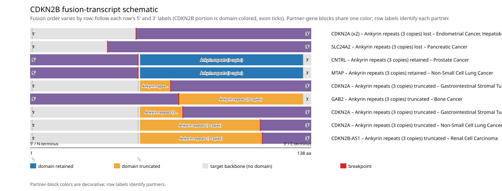

# CDKN2B real-data fusion benchmark: msk_impact_50k_2026

Retrieved from public cBioPortal and Genome Nexus on 2026-09-15.

## Results

- Structural variants returned for CDKN2B: 40
- Protein-fusion records found: 12
- Protein-fusion records mapped: 10
- Malformed/unmappable fusion records skipped: 2
- In-frame among known-frame events: 2/3 (66.7%)
- Unknown frame status: 7/10
- Ankyrin repeats (3 copies) (54-134 aa) retained: 2/10 (20.0%)
- In-frame and Ankyrin repeats (3 copies)-retained: 2/2
- Fisher exact test (one-sided): odds ratio unavailable, p=0.0222222
- Breakpoint-permutation empirical p-value: 0.041958
- Contingency table `[[retained/in-frame, retained/other], [not-retained/in-frame, not-retained/other]]`: `[[2, 0], [0, 8]]`

- Mutation/CNA co-occurrence: not computed (CDKN2B has no mutual_exclusivity_targets configured; co-occurrence/mutual-exclusivity analysis was skipped.)

### Mechanistic interpretation

**Ankyrin repeats (3 copies) retention:** statistically supported (p=0.0222222, odds ratio=unavailable). All 2 in-frame events with a determinate status match it -- no counter-intuitive events observed.

### Domain retention and discrepancies

*Domain-retention positions for analyzed fusion events; red outlines mark reference discrepancies.*

### Fusion-transcript schematic

*One row per recurrent partner/breakpoint group, sharing one amino-acid x-axis for CDKN2B's full protein length; the partner-contributed portion is colored per partner, the retained target-gene portion is colored by domain-retention status, and a red line marks the breakpoint.*

## Method

The cBioPortal `msk_impact_50k_2026_structural_variants` structural-variant profile was queried by the configured Entrez gene ID. Fusion-annotated records were adapted to the production SV schema and normalized; when `site2EffectOnFrame=NA`, frame status was resolved from `Event_Info`, not copied into `FusionEvent.Frame_status`.

CDKN2B genomic breakpoints were mapped against the Genome Nexus canonical transcript, and retention was classified against its returned Ankyrin repeats (3 copies) coordinates. Counts are event-level with no patient deduplication. In-frame percentage uses only events explicitly called in-frame or out-of-frame; unknown-frame events are reported separately and excluded from that denominator. The Fisher comparison's `other` column combines out-of-frame and unknown-frame events, as pre-specified by the domain-retention algorithm.

For each fusion, breakpoint selection preferred the Genome Nexus canonical transcript's exon-spanned target locus over cBioPortal site labels; malformed rows with no unambiguous target-locus coordinate were skipped and listed in Warnings.

## Full-suite highlights

- Registered algorithms executed: composite_score, confidence_stats, cutpoint_detection, domain_disruption, domain_retention, exon_retention, expression_association, frequency, genomic_position_recurrence, joint_partner, mechanistic_interpretation, mutation_cooccurrence, window_detection
- Cutpoint detection: inferred breakpoint 53 aa (exon 2); corrected permutation p=0.762376.
- Genomic-position recurrence: The 2 events sharing protein position 53 aa use 2 distinct genomic positions spanning 42 bp -- the protein-position recurrence is broader than any single genomic hotspot, consistent with independent intronic breakpoints mapped (or clamped) onto the same protein/exon boundary rather than one shared DNA lesion.
- Top composite score: CDKN2A (6 events), 0.39087.
- Expression association: No mRNA expression data was available for CDKN2B in this cohort; expression-association analysis was skipped.

## Partners

CDKN2A (6), CDKN2B-AS1 (1), CNTRL (1), ELAVL2 (1), GAB2 (1), MTAP (1), SLC24A2 (1)

## Warnings

- Skipped EVT-P-0031864-T01-IM6-4 (CDKN2A-CDKN2B): ValueError: CDKN2B fusion has no site breakpoint within target locus 22002902-22009362: Site1=21971407, Site2=22002380
- Skipped EVT-P-0020010-T01-IM6-35 (CDKN2B-ELAVL2): ValueError: could not determine 5'/3' role for CDKN2B in EVT-P-0020010-T01-IM6-35; Event_Info='Antisense Fusion'

## Interpretation

These values describe the live study named above.
