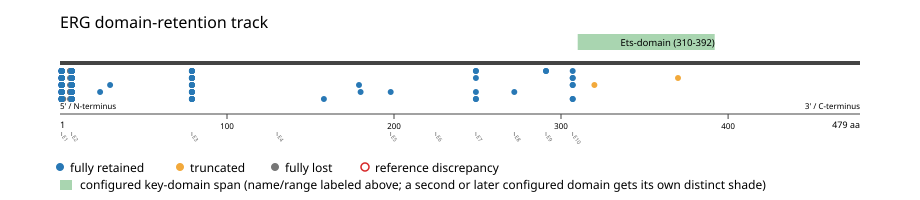

# ERG real-data fusion benchmark: msk_impact_50k_2026

Retrieved from public cBioPortal and Genome Nexus on 2026-09-15.

## Results

- Structural variants returned for ERG: 863
- Protein-fusion records found: 788
- Protein-fusion records mapped: 775
- Malformed/unmappable fusion records skipped: 13
- In-frame among known-frame events: 238/722 (33.0%)
- Unknown frame status: 53/775
- Ets-domain (310-392 aa) retained: 757/775 (97.7%)
- In-frame and Ets-domain-retained: 231/238
- Fisher exact test (one-sided): odds ratio 0.690114, p=0.846156
- Breakpoint-permutation empirical p-value: 0.00990099
- Contingency table `[[retained/in-frame, retained/other], [not-retained/in-frame, not-retained/other]]`: `[[231, 526], [7, 11]]`

- Mutation/CNA co-occurrence: not computed (ERG has no mutual_exclusivity_targets configured; co-occurrence/mutual-exclusivity analysis was skipped.)

### Mechanistic interpretation

**Curated mechanism:** Aberrant transcription factor, not domain-retention kinase signaling: ERG is an ETS-family transcription factor, not a kinase, so its mechanism differs fundamentally from BRAF/ALK/RET/ROS1/NTRK-family fusions. Retaining the ETS DNA-binding domain preserves ERG's target-gene specificity. Depending on the fusion partner, activation then comes from one of two distinct routes. In the dominant TMPRSS2::ERG isoform (>90% of fusion transcripts), TMPRSS2's exon 1 is untranslated, so no TMPRSS2 amino acids are present at all -- this is a pure cis-regulatory promoter/enhancer swap, not a chimeric protein in the BCR-ABL/EWS-FLI1 sense: the androgen-responsive TMPRSS2 promoter drives massive overexpression of an N-terminally truncated but otherwise intact ERG, translated from an internal ATG in ERG exon 4 (see the tmprss2-erg.yaml config's own mechanism_note). Other ERG fusion partners instead contribute an N-terminal transactivation domain fused in-frame to the ETS domain (e.g. EWSR1-ERG), the same true-chimeric-transcription-factor strategy as EWSR1-FLI1 -- so which of the two routes applies for a given ERG fusion depends on the specific partner and breakpoint, not on ERG alone.

**Ets-domain retention:** not statistically significant (p=0.846156, odds ratio=0.690114) -- too weak to say what this gene's fusions require, let alone characterize which events run counter to it.

### Domain retention and discrepancies

*Domain-retention positions for analyzed fusion events; red outlines mark reference discrepancies.*

### Fusion-transcript schematic

*One row per recurrent partner/breakpoint group, sharing one amino-acid x-axis for ERG's full protein length; the partner-contributed portion is colored per partner, the retained target-gene portion is colored by domain-retention status, and a red line marks the breakpoint.*

## Method

The cBioPortal `msk_impact_50k_2026_structural_variants` structural-variant profile was queried by the configured Entrez gene ID. Fusion-annotated records were adapted to the production SV schema and normalized; when `site2EffectOnFrame=NA`, frame status was resolved from `Event_Info`, not copied into `FusionEvent.Frame_status`.

ERG genomic breakpoints were mapped against the Genome Nexus canonical transcript, and retention was classified against its returned Ets-domain coordinates. Counts are event-level with no patient deduplication. In-frame percentage uses only events explicitly called in-frame or out-of-frame; unknown-frame events are reported separately and excluded from that denominator. The Fisher comparison's `other` column combines out-of-frame and unknown-frame events, as pre-specified by the domain-retention algorithm.

For each fusion, breakpoint selection preferred the Genome Nexus canonical transcript's exon-spanned target locus over cBioPortal site labels; malformed rows with no unambiguous target-locus coordinate were skipped and listed in Warnings.

## Full-suite highlights

- Registered algorithms executed: composite_score, confidence_stats, cutpoint_detection, domain_disruption, domain_retention, exon_retention, expression_association, frequency, genomic_position_recurrence, joint_partner, mechanistic_interpretation, mutation_cooccurrence, window_detection
- Cutpoint detection: inferred breakpoint 307 aa (exon 9/10 boundary); corrected permutation p=0.00990099.
- Genomic-position recurrence: The 7 events sharing protein position 307 aa use 7 distinct genomic positions spanning 6147 bp -- the protein-position recurrence is broader than any single genomic hotspot, consistent with independent intronic breakpoints mapped (or clamped) onto the same protein/exon boundary rather than one shared DNA lesion.
- Top composite score: TMPRSS2 (764 events), 0.517906.
- Expression association: No mRNA expression data was available for ERG in this cohort; expression-association analysis was skipped.

## Partners

EWSR1 (17), FLI1 (1), GABPA (1), NETO1 (1), PDE1C (1), RBBP8 (1), TMPRSS2 (764), TNK1 (1), UBASH3A (1)

## Warnings

- Skipped EVT-P-0003294-T02-IM5-14 (ERG-PDE1C): ValueError: could not determine 5'/3' role for ERG in EVT-P-0003294-T02-IM5-14; Event_Info='Antisense fusion'
- Skipped EVT-P-0064423-T01-IM7-23 (ERG-TMPRSS2): ValueError: could not determine 5'/3' role for ERG in EVT-P-0064423-T01-IM7-23; Event_Info='Antisense Fusion'
- Skipped EVT-P-0005081-T01-IM5-81 (ERG-TMPRSS2): ValueError: could not determine 5'/3' role for ERG in EVT-P-0005081-T01-IM5-81; Event_Info='Antisense fusion'
- Skipped EVT-P-0006057-T01-IM5-102 (ERG-TMPRSS2): ValueError: could not determine 5'/3' role for ERG in EVT-P-0006057-T01-IM5-102; Event_Info='Antisense fusion'
- Skipped EVT-P-0052874-T01-IM6-105 (ERG-TMPRSS2): ValueError: could not determine 5'/3' role for ERG in EVT-P-0052874-T01-IM6-105; Event_Info='Antisense Fusion'
- Skipped EVT-P-0050541-T01-IM6-121 (ERG-TMPRSS2): ValueError: could not determine 5'/3' role for ERG in EVT-P-0050541-T01-IM6-121; Event_Info='Antisense Fusion'
- Skipped EVT-P-0050022-T02-IM6-143 (ERG-TMPRSS2): ValueError: could not determine 5'/3' role for ERG in EVT-P-0050022-T02-IM6-143; Event_Info='Antisense Fusion'
- Skipped EVT-P-0012322-T01-IM5-215 (ERG-TMPRSS2): ValueError: could not determine 5'/3' role for ERG in EVT-P-0012322-T01-IM5-215; Event_Info='Antisense fusion'
- Skipped EVT-P-0013858-T02-IM5-245 (ERG-TMPRSS2): ValueError: could not determine 5'/3' role for ERG in EVT-P-0013858-T02-IM5-245; Event_Info='Antisense fusion'
- Skipped EVT-P-0018791-T01-IM6-324 (ERG-TMPRSS2): ValueError: could not determine 5'/3' role for ERG in EVT-P-0018791-T01-IM6-324; Event_Info='Antisense Fusion'
- Skipped EVT-P-0018812-T01-IM6-326 (ERG-TMPRSS2): ValueError: could not determine 5'/3' role for ERG in EVT-P-0018812-T01-IM6-326; Event_Info='Antisense Fusion'
- Skipped EVT-P-0025793-T01-IM6-424 (ERG-TMPRSS2): ValueError: could not determine 5'/3' role for ERG in EVT-P-0025793-T01-IM6-424; Event_Info='Antisense Fusion'
- Skipped EVT-P-0028090-T01-IM6-452 (ERG-TMPRSS2): ValueError: could not determine 5'/3' role for ERG in EVT-P-0028090-T01-IM6-452; Event_Info='Antisense Fusion'

## Interpretation

These values describe the live study named above.
