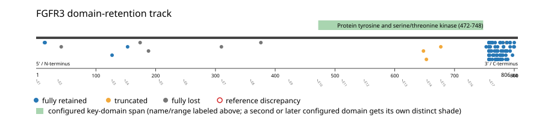
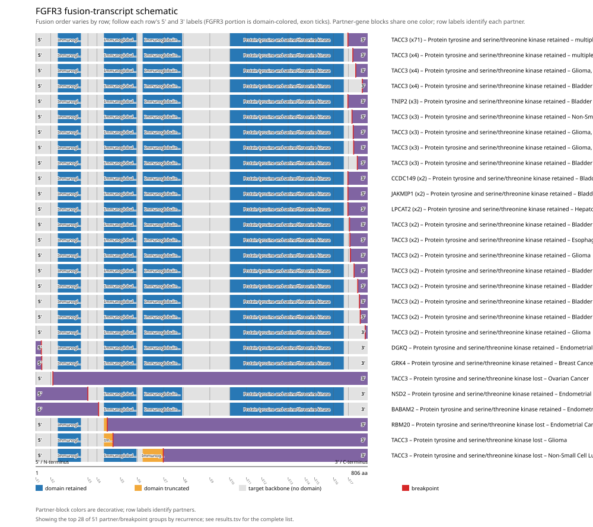
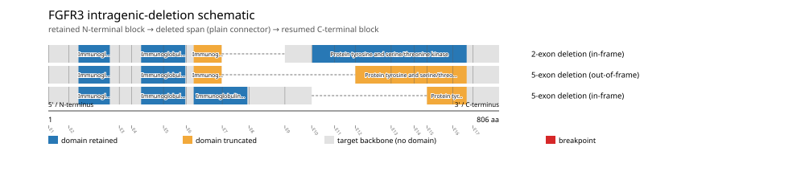

# FGFR3 real-data fusion benchmark: msk_impact_50k_2026

Retrieved from public cBioPortal and Genome Nexus on 2026-09-15.

## Results

- Structural variants returned for FGFR3: 195
- Protein-fusion records found: 152
- Protein-fusion records mapped: 151
- Malformed/unmappable fusion records skipped: 1
- In-frame among known-frame events: 74/76 (97.4%)
- Unknown frame status: 75/151
- Protein tyrosine and serine/threonine kinase (472-748 aa) retained: 142/151 (94.0%)
- In-frame and Protein tyrosine and serine/threonine kinase-retained: 73/74
- Fisher exact test (one-sided): odds ratio 8.46377, p=0.0194824
- Breakpoint-permutation empirical p-value: 0.00990099
- Contingency table `[[retained/in-frame, retained/other], [not-retained/in-frame, not-retained/other]]`: `[[73, 69], [1, 8]]`

The Protein tyrosine and serine/threonine kinase appears to be required for retention.

- Mutation/CNA co-occurrence: not computed (FGFR3 has no mutual_exclusivity_targets configured; co-occurrence/mutual-exclusivity analysis was skipped.)

### Mechanistic interpretation

**Protein tyrosine and serine/threonine kinase retention:** statistically supported (p=0.0194824, odds ratio=8.46377), but 1/74 in-frame events (1.4%) show the opposite status.

Spread across distinct partner genes with no partner recurring 2+ times among them -- consistent with background noise or individual passenger events rather than a distinct recurrent subgroup; too weak to infer an alternate mechanism from this cohort alone.

| Event | Sample | Partner | Breakpoint (aa) | Status |
|---|---|---|---:|---|
| EVT-P-0015024-T01-IM6-175 | P-0015024-T01-IM6 | TACC3 | 677 | disrupted |

**Immunoglobulin domain and Immunoglobulin I-set domain disruption:** not statistically significant (p=0.934975, odds ratio=0.3379) -- too weak to say what this gene's fusions require, let alone characterize which events run counter to it.

### Domain retention and discrepancies

*Domain-retention positions for analyzed fusion events; red outlines mark reference discrepancies.*

### Fusion-transcript schematic

*One row per recurrent partner/breakpoint group, sharing one amino-acid x-axis for FGFR3's full protein length; the partner-contributed portion is colored per partner, the retained target-gene portion is colored by domain-retention status, and a red line marks the breakpoint.*

### Intragenic-deletion schematic

*Same-gene (Site1==Site2==FGFR3) intragenic-deletion-style SV records: a retained N-terminal block, a plain connector line for the deleted span, and a resumed C-terminal block.*

## Method

The cBioPortal `msk_impact_50k_2026_structural_variants` structural-variant profile was queried by the configured Entrez gene ID. Fusion-annotated records were adapted to the production SV schema and normalized; when `site2EffectOnFrame=NA`, frame status was resolved from `Event_Info`, not copied into `FusionEvent.Frame_status`.

FGFR3 genomic breakpoints were mapped against the Genome Nexus canonical transcript, and retention was classified against its returned Protein tyrosine and serine/threonine kinase coordinates. Counts are event-level with no patient deduplication. In-frame percentage uses only events explicitly called in-frame or out-of-frame; unknown-frame events are reported separately and excluded from that denominator. The Fisher comparison's `other` column combines out-of-frame and unknown-frame events, as pre-specified by the domain-retention algorithm.

For each fusion, breakpoint selection preferred the Genome Nexus canonical transcript's exon-spanned target locus over cBioPortal site labels; malformed rows with no unambiguous target-locus coordinate were skipped and listed in Warnings.

## Full-suite highlights

- Registered algorithms executed: composite_score, confidence_stats, cutpoint_detection, domain_disruption, domain_retention, exon_retention, expression_association, frequency, genomic_position_recurrence, joint_partner, mechanistic_interpretation, mutation_cooccurrence, window_detection
- Cutpoint detection: inferred breakpoint 677 aa (exon 14/15 boundary); corrected permutation p=0.00990099.
- Genomic-position recurrence: The 82 events sharing protein position 758 aa use 57 distinct genomic positions spanning 181 bp -- the protein-position recurrence is broader than any single genomic hotspot, consistent with independent intronic breakpoints mapped (or clamped) onto the same protein/exon boundary rather than one shared DNA lesion.
- Top composite score: TACC3 (131 events), 0.492268.
- Expression association: No mRNA expression data was available for FGFR3 in this cohort; expression-association analysis was skipped.

## Partners

BABAM2 (1), CCDC149 (2), CTBP1 (1), DGKQ (1), GRK4 (1), JAKMIP1 (2), LPCAT2 (2), MAEA (1), NSD2 (3), PTBP1 (1), RBM20 (1), ROBO1 (1), SLIT2 (1), TACC3 (131), TNIP2 (3)

## Warnings

- Skipped EVT-P-0020683-T01-IM6-45 (FGFR3-SLIT2): ValueError: could not determine 5'/3' role for FGFR3 in EVT-P-0020683-T01-IM6-45; Event_Info='Antisense Fusion'

## Interpretation

These values describe the live study named above.
