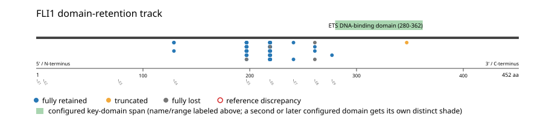
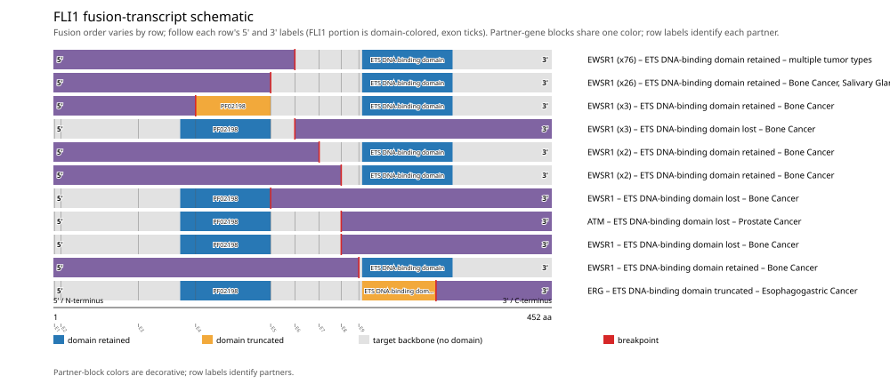

# FLI1 real-data fusion benchmark: msk_impact_50k_2026

Retrieved from public cBioPortal and Genome Nexus on 2026-09-15.

## Results

- Structural variants returned for FLI1: 121
- Protein-fusion records found: 118
- Protein-fusion records mapped: 117
- Malformed/unmappable fusion records skipped: 1
- In-frame among known-frame events: 73/107 (68.2%)
- Unknown frame status: 10/117
- ETS DNA-binding domain (280-362 aa) retained: 110/117 (94.0%)
- In-frame and ETS DNA-binding domain-retained: 71/73
- Fisher exact test (one-sided): odds ratio 4.55128, p=0.0687101
- Breakpoint-permutation empirical p-value: 0.554455
- Contingency table `[[retained/in-frame, retained/other], [not-retained/in-frame, not-retained/other]]`: `[[71, 39], [2, 5]]`

- Mutation/CNA co-occurrence: not computed (FLI1 has no mutual_exclusivity_targets configured; co-occurrence/mutual-exclusivity analysis was skipped.)

### Mechanistic interpretation

**Curated mechanism:** Chimeric (neomorphic) transcription factor -- a fundamentally different category from the domain-retention kinase mechanism BRAF/ALK/RET/ROS1/ NTRK-family fusions rely on: nothing catalytic is retained and nothing autoinhibitory is removed. The EWSR1::FLI1 translocation grafts EWSR1's N-terminal, intrinsically disordered, prion-like low-complexity domain onto FLI1's C-terminal ETS DNA-binding domain, replacing FLI1's own weak native activation domain. DNA-binding sequence specificity is unchanged, but only the fusion productively engages tandem GGAA-microsatellite repeats that have no regulatory potential in other cell types: at these repeats, the EWSR1 low-complexity domain recruits the BAF (SWI/SNF) chromatin-remodeling complex to open closed chromatin and generate de novo enhancers, a gain-of-function activity neither parent protein has on its own. This is transcriptional/chromatin-based oncogenesis, not domain-retention kinase signaling.

**ETS DNA-binding domain retention:** not statistically significant (p=0.0687101, odds ratio=4.55128) -- too weak to say what this gene's fusions require, let alone characterize which events run counter to it.

### Domain retention and discrepancies

*Domain-retention positions for analyzed fusion events; red outlines mark reference discrepancies.*

### Fusion-transcript schematic

*One row per recurrent partner/breakpoint group, sharing one amino-acid x-axis for FLI1's full protein length; the partner-contributed portion is colored per partner, the retained target-gene portion is colored by domain-retention status, and a red line marks the breakpoint.*

## Method

The cBioPortal `msk_impact_50k_2026_structural_variants` structural-variant profile was queried by the configured Entrez gene ID. Fusion-annotated records were adapted to the production SV schema and normalized; when `site2EffectOnFrame=NA`, frame status was resolved from `Event_Info`, not copied into `FusionEvent.Frame_status`.

FLI1 genomic breakpoints were mapped against the Genome Nexus canonical transcript, and retention was classified against its returned ETS DNA-binding domain coordinates. Counts are event-level with no patient deduplication. In-frame percentage uses only events explicitly called in-frame or out-of-frame; unknown-frame events are reported separately and excluded from that denominator. The Fisher comparison's `other` column combines out-of-frame and unknown-frame events, as pre-specified by the domain-retention algorithm.

For each fusion, breakpoint selection preferred the Genome Nexus canonical transcript's exon-spanned target locus over cBioPortal site labels; malformed rows with no unambiguous target-locus coordinate were skipped and listed in Warnings.

## Full-suite highlights

- Registered algorithms executed: composite_score, confidence_stats, cutpoint_detection, domain_disruption, domain_retention, exon_retention, expression_association, frequency, genomic_position_recurrence, joint_partner, mechanistic_interpretation, mutation_cooccurrence, window_detection
- Cutpoint detection: inferred breakpoint 241 aa (exon 6/7 boundary); corrected permutation p=0.019802.
- Genomic-position recurrence: The 2 events sharing protein position 241 aa use 2 distinct genomic positions spanning 244 bp -- the protein-position recurrence is broader than any single genomic hotspot, consistent with independent intronic breakpoints mapped (or clamped) onto the same protein/exon boundary rather than one shared DNA lesion.
- Top composite score: EWSR1 (116 events), 0.58578.
- Expression association: No mRNA expression data was available for FLI1 in this cohort; expression-association analysis was skipped.

## Partners

ATM (1), ERG (1), EWSR1 (116)

## Warnings

- Skipped EVT-P-0008749-T01-IM5-24 (EWSR1-FLI1): ValueError: could not determine 5'/3' role for FLI1 in EVT-P-0008749-T01-IM5-24; Event_Info='Antisense fusion'

## Interpretation

These values describe the live study named above.
