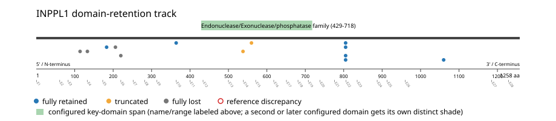
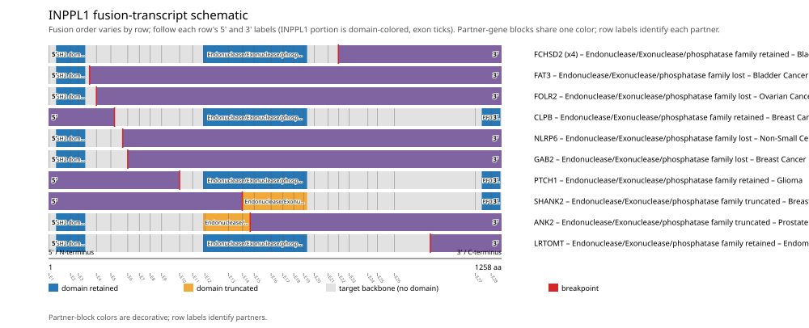

# INPPL1 real-data fusion benchmark: msk_impact_50k_2026

Retrieved from public cBioPortal and Genome Nexus on 2026-09-15.

## Results

- Structural variants returned for INPPL1: 39
- Protein-fusion records found: 14
- Protein-fusion records mapped: 13
- Malformed/unmappable fusion records skipped: 1
- In-frame among known-frame events: 4/7 (57.1%)
- Unknown frame status: 6/13
- Endonuclease/Exonuclease/phosphatase family (429-718 aa) retained: 7/13 (53.8%)
- In-frame and Endonuclease/Exonuclease/phosphatase family-retained: 4/4
- Fisher exact test (one-sided): odds ratio unavailable, p=0.048951
- Breakpoint-permutation empirical p-value: 0.108911
- Contingency table `[[retained/in-frame, retained/other], [not-retained/in-frame, not-retained/other]]`: `[[4, 3], [0, 6]]`

- Mutation/CNA co-occurrence: not computed (INPPL1 has no mutual_exclusivity_targets configured; co-occurrence/mutual-exclusivity analysis was skipped.)

### Mechanistic interpretation

**Endonuclease/Exonuclease/phosphatase family retention:** statistically supported (p=0.048951, odds ratio=unavailable). All 4 in-frame events with a determinate status match it -- no counter-intuitive events observed.

**SH2 domain disruption:** not statistically significant (p=1, odds ratio=0) -- too weak to say what this gene's fusions require, let alone characterize which events run counter to it.

### Domain retention and discrepancies

*Domain-retention positions for analyzed fusion events; red outlines mark reference discrepancies.*

### Fusion-transcript schematic

*One row per recurrent partner/breakpoint group, sharing one amino-acid x-axis for INPPL1's full protein length; the partner-contributed portion is colored per partner, the retained target-gene portion is colored by domain-retention status, and a red line marks the breakpoint.*

## Method

The cBioPortal `msk_impact_50k_2026_structural_variants` structural-variant profile was queried by the configured Entrez gene ID. Fusion-annotated records were adapted to the production SV schema and normalized; when `site2EffectOnFrame=NA`, frame status was resolved from `Event_Info`, not copied into `FusionEvent.Frame_status`.

INPPL1 genomic breakpoints were mapped against the Genome Nexus canonical transcript, and retention was classified against its returned Endonuclease/Exonuclease/phosphatase family coordinates. Counts are event-level with no patient deduplication. In-frame percentage uses only events explicitly called in-frame or out-of-frame; unknown-frame events are reported separately and excluded from that denominator. The Fisher comparison's `other` column combines out-of-frame and unknown-frame events, as pre-specified by the domain-retention algorithm.

For each fusion, breakpoint selection preferred the Genome Nexus canonical transcript's exon-spanned target locus over cBioPortal site labels; malformed rows with no unambiguous target-locus coordinate were skipped and listed in Warnings.

## Full-suite highlights

- Registered algorithms executed: composite_score, confidence_stats, cutpoint_detection, domain_disruption, domain_retention, exon_retention, expression_association, frequency, genomic_position_recurrence, joint_partner, mechanistic_interpretation, mutation_cooccurrence, window_detection
- Cutpoint detection: inferred breakpoint 560 aa (exon 14); corrected permutation p=0.033966.
- Genomic-position recurrence: The 4 events sharing protein position 805 aa use 3 distinct genomic positions spanning 64 bp -- the protein-position recurrence is broader than any single genomic hotspot, consistent with independent intronic breakpoints mapped (or clamped) onto the same protein/exon boundary rather than one shared DNA lesion.
- Top composite score: ANK2 (1 events), 0.233209.
- Expression association: No mRNA expression data was available for INPPL1 in this cohort; expression-association analysis was skipped.

## Partners

ANK2 (1), CLPB (1), FAT3 (1), FCHSD2 (4), FOLR2 (1), GAB2 (1), LRTOMT (1), NLRP6 (1), PTCH1 (1), SHANK2 (1), SLC67A1 (1)

## Warnings

- Skipped EVT-P-0032233-T01-IM6-38 (SLC67A1-INPPL1): ValueError: could not determine 5'/3' role for INPPL1 in EVT-P-0032233-T01-IM6-38; Event_Info='Antisense Fusion'

## Interpretation

These values describe the live study named above.
