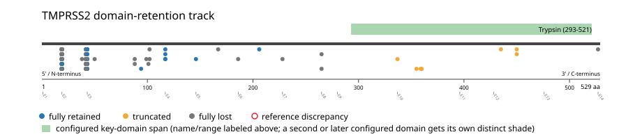
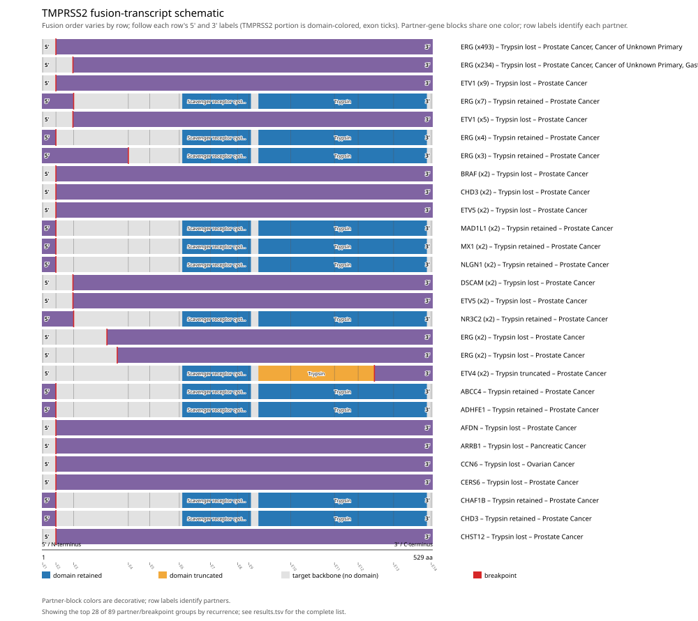
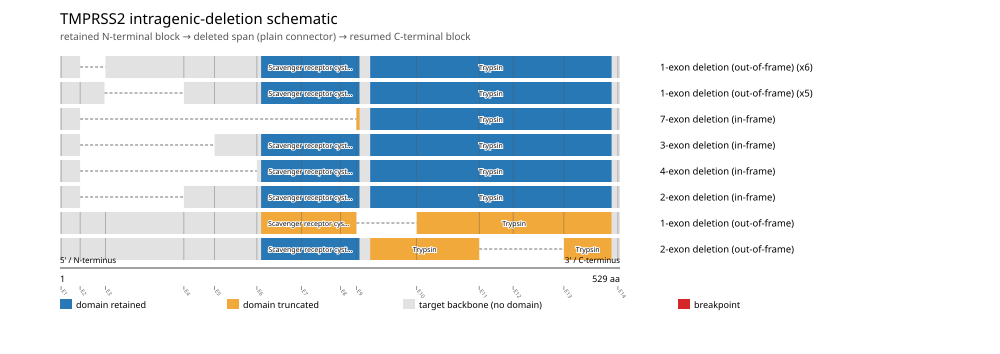

# TMPRSS2 real-data fusion benchmark: msk_impact_50k_2026

Retrieved from public cBioPortal and Genome Nexus on 2026-09-15.

## Results

- Structural variants returned for TMPRSS2: 1132
- Protein-fusion records found: 867
- Protein-fusion records mapped: 849
- Malformed/unmappable fusion records skipped: 18
- In-frame among known-frame events: 260/780 (33.3%)
- Unknown frame status: 69/849
- Trypsin (293-521 aa) retained: 53/849 (6.2%)
- In-frame and Trypsin-retained: 23/260
- Fisher exact test (one-sided): odds ratio 1.8083, p=0.0292045
- Breakpoint-permutation empirical p-value: 1
- Contingency table `[[retained/in-frame, retained/other], [not-retained/in-frame, not-retained/other]]`: `[[23, 30], [237, 559]]`

The Trypsin appears to be required for retention.

- Mutation/CNA co-occurrence: not computed (TMPRSS2 has no mutual_exclusivity_targets configured; co-occurrence/mutual-exclusivity analysis was skipped.)

### Mechanistic interpretation

**Trypsin retention:** statistically supported (p=0.0292045, odds ratio=1.8083), but 237/260 in-frame events (91.2%) show the opposite status.

ERG (x218), ETV1 (x9), BRAF (x2), ETV5 (x2) recur among just these counter-intuitive events -- a candidate subgroup that may follow a distinct, not-yet-curated mechanism. This is flagged for manual curator review, not asserted as a confirmed alternate mechanism.

| Event | Sample | Partner | Breakpoint (aa) | Status |
|---|---|---|---:|---|
| EVT-P-0012132-T02-IM6-14 | P-0012132-T02-IM6 | ERG | 42 | lost |
| EVT-P-0017312-T01-IM6-15 | P-0017312-T01-IM6 | ERG | 42 | lost |
| EVT-P-0001242-T05-IM6-20 | P-0001242-T05-IM6 | ERG | 42 | lost |
| EVT-P-0001845-T01-IM3-25 | P-0001845-T01-IM3 | ERG | 42 | lost |
| EVT-P-0001242-T04-IM6-28 | P-0001242-T04-IM6 | ERG | 42 | lost |
| EVT-P-0001242-T03-IM5-31 | P-0001242-T03-IM5 | ERG | 42 | lost |
| EVT-P-0002149-T02-IM3-32 | P-0002149-T02-IM3 | ERG | 42 | lost |
| EVT-P-0002206-T01-IM3-33 | P-0002206-T01-IM3 | ERG | 42 | lost |
| EVT-P-0002880-T01-IM3-46 | P-0002880-T01-IM3 | ERG | 42 | lost |
| EVT-P-0002894-T01-IM3-47 | P-0002894-T01-IM3 | ERG | 42 | lost |
| EVT-P-0002901-T01-IM3-49 | P-0002901-T01-IM3 | ERG | 42 | lost |
| EVT-P-0002990-T01-IM3-54 | P-0002990-T01-IM3 | ERG | 42 | lost |
| EVT-P-0002990-T02-IM5-55 | P-0002990-T02-IM5 | ERG | 42 | lost |
| EVT-P-0002990-T03-IM6-56 | P-0002990-T03-IM6 | ERG | 42 | lost |
| EVT-P-0003541-T01-IM5-72 | P-0003541-T01-IM5 | ERG | 42 | lost |
| EVT-P-0003592-T01-IM5-73 | P-0003592-T01-IM5 | ERG | 42 | lost |
| EVT-P-0003592-T02-IM5-74 | P-0003592-T02-IM5 | ERG | 42 | lost |
| EVT-P-0003619-T01-IM5-78 | P-0003619-T01-IM5 | ERG | 42 | lost |
| EVT-P-0003626-T01-IM5-79 | P-0003626-T01-IM5 | ERG | 42 | lost |
| EVT-P-0003678-T02-IM6-80 | P-0003678-T02-IM6 | ERG | 42 | lost |
| EVT-P-0003908-T01-IM3-83 | P-0003908-T01-IM3 | ERG | 42 | lost |
| EVT-P-0025150-T01-IM6-87 | P-0025150-T01-IM6 | ERG | 42 | lost |
| EVT-P-0004297-T02-IM5-89 | P-0004297-T02-IM5 | ERG | 42 | lost |
| EVT-P-0004532-T01-IM5-92 | P-0004532-T01-IM5 | ERG | 42 | lost |
| EVT-P-0005098-T02-IM5-101 | P-0005098-T02-IM5 | ERG | 42 | lost |
| EVT-P-0000888-T01-IM3-107 | P-0000888-T01-IM3 | ERG | 42 | lost |
| EVT-P-0025851-T01-IM6-108 | P-0025851-T01-IM6 | ERG | 42 | lost |
| EVT-P-0005463-T01-IM5-109 | P-0005463-T01-IM5 | ERG | 42 | lost |
| EVT-P-0005546-T01-IM5-110 | P-0005546-T01-IM5 | ERG | 42 | lost |
| EVT-P-0005698-T01-IM5-117 | P-0005698-T01-IM5 | ERG | 42 | lost |
| EVT-P-0005756-T01-IM5-118 | P-0005756-T01-IM5 | ERG | 42 | lost |
| EVT-P-0006108-T01-IM5-126 | P-0006108-T01-IM5 | ERG | 42 | lost |
| EVT-P-0006108-T02-IM5-128 | P-0006108-T02-IM5 | ERG | 42 | lost |
| EVT-P-0036699-T01-IM6-130 | P-0036699-T01-IM6 | ERG | 42 | lost |
| EVT-P-0006602-T02-IM5-132 | P-0006602-T02-IM5 | ERG | 42 | lost |
| EVT-P-0006602-T03-IM6-133 | P-0006602-T03-IM6 | ERG | 42 | lost |
| EVT-P-0006619-T01-IM5-136 | P-0006619-T01-IM5 | ERG | 42 | lost |
| EVT-P-0036438-T01-IM6-141 | P-0036438-T01-IM6 | ERG | 42 | lost |
| EVT-P-0007043-T01-IM5-151 | P-0007043-T01-IM5 | ERG | 42 | lost |
| EVT-P-0007043-T02-IM6-152 | P-0007043-T02-IM6 | ERG | 42 | lost |
| EVT-P-0036294-T01-IM6-153 | P-0036294-T01-IM6 | ERG | 42 | lost |
| EVT-P-0025851-T02-IM6-155 | P-0025851-T02-IM6 | ERG | 42 | lost |
| EVT-P-0007307-T01-IM5-156 | P-0007307-T01-IM5 | ERG | 42 | lost |
| EVT-P-0007307-T02-IM5-157 | P-0007307-T02-IM5 | ERG | 42 | lost |
| EVT-P-0007307-T03-IM6-158 | P-0007307-T03-IM6 | ERG | 42 | lost |
| EVT-P-0007343-T01-IM5-159 | P-0007343-T01-IM5 | ERG | 42 | lost |
| EVT-P-0007343-T02-IM6-160 | P-0007343-T02-IM6 | ERG | 42 | lost |
| EVT-P-0036120-T01-IM6-167 | P-0036120-T01-IM6 | ERG | 42 | lost |
| EVT-P-0007576-T01-IM5-168 | P-0007576-T01-IM5 | ERG | 42 | lost |
| EVT-P-0007770-T01-IM5-170 | P-0007770-T01-IM5 | ERG | 42 | lost |
| EVT-P-0008077-T01-IM5-172 | P-0008077-T01-IM5 | ERG | 42 | lost |
| EVT-P-0008139-T01-IM5-173 | P-0008139-T01-IM5 | ERG | 42 | lost |
| EVT-P-0008139-T02-IM5-174 | P-0008139-T02-IM5 | ERG | 42 | lost |
| EVT-P-0008139-T03-IM5-175 | P-0008139-T03-IM5 | ERG | 42 | lost |
| EVT-P-0008232-T01-IM5-178 | P-0008232-T01-IM5 | ERG | 42 | lost |
| EVT-P-0035854-T01-IM6-181 | P-0035854-T01-IM6 | ERG | 42 | lost |
| EVT-P-0008441-T01-IM5-183 | P-0008441-T01-IM5 | ERG | 42 | lost |
| EVT-P-0035818-T01-IM6-184 | P-0035818-T01-IM6 | ERG | 42 | lost |
| EVT-P-0008525-T01-IM5-186 | P-0008525-T01-IM5 | ERG | 42 | lost |
| EVT-P-0008525-T02-IM6-187 | P-0008525-T02-IM6 | ERG | 42 | lost |
| EVT-P-0008591-T01-IM5-189 | P-0008591-T01-IM5 | ERG | 42 | lost |
| EVT-P-0008812-T01-IM5-194 | P-0008812-T01-IM5 | ERG | 42 | lost |
| EVT-P-0008879-T01-IM5-196 | P-0008879-T01-IM5 | ERG | 42 | lost |
| EVT-P-0035284-T01-IM6-197 | P-0035284-T01-IM6 | ERG | 42 | lost |
| EVT-P-0008960-T01-IM5-200 | P-0008960-T01-IM5 | ERG | 42 | lost |
| EVT-P-0008960-T02-IM6-201 | P-0008960-T02-IM6 | ERG | 42 | lost |
| EVT-P-0009361-T01-IM5-211 | P-0009361-T01-IM5 | ERG | 42 | lost |
| EVT-P-0009374-T02-IM5-212 | P-0009374-T02-IM5 | ERG | 42 | lost |
| EVT-P-0026153-T01-IM6-215 | P-0026153-T01-IM6 | ERG | 42 | lost |
| EVT-P-0009728-T01-IM5-218 | P-0009728-T01-IM5 | ERG | 42 | lost |
| EVT-P-0009786-T01-IM5-219 | P-0009786-T01-IM5 | ERG | 42 | lost |
| EVT-P-0009786-T02-IM5-220 | P-0009786-T02-IM5 | ERG | 42 | lost |
| EVT-P-0009819-T01-IM5-223 | P-0009819-T01-IM5 | ERG | 42 | lost |
| EVT-P-0009892-T01-IM5-225 | P-0009892-T01-IM5 | ERG | 42 | lost |
| EVT-P-0010071-T01-IM5-227 | P-0010071-T01-IM5 | ERG | 42 | lost |
| EVT-P-0010659-T01-IM5-228 | P-0010659-T01-IM5 | ERG | 42 | lost |
| EVT-P-0011377-T01-IM5-239 | P-0011377-T01-IM5 | ERG | 42 | lost |
| EVT-P-0011577-T01-IM5-247 | P-0011577-T01-IM5 | ERG | 42 | lost |
| EVT-P-0012029-T01-IM5-248 | P-0012029-T01-IM5 | ERG | 42 | lost |
| EVT-P-0012048-T01-IM5-251 | P-0012048-T01-IM5 | ERG | 42 | lost |
| EVT-P-0012132-T01-IM5-257 | P-0012132-T01-IM5 | ERG | 42 | lost |
| EVT-P-0012321-T01-IM5-264 | P-0012321-T01-IM5 | ERG | 42 | lost |
| EVT-P-0012368-T01-IM5-268 | P-0012368-T01-IM5 | ERG | 42 | lost |
| EVT-P-0018713-T01-IM6-277 | P-0018713-T01-IM6 | ERG | 42 | lost |
| EVT-P-0012914-T01-IM5-278 | P-0012914-T01-IM5 | ERG | 42 | lost |
| EVT-P-0013465-T01-IM5-286 | P-0013465-T01-IM5 | ERG | 42 | lost |
| EVT-P-0013733-T01-IM5-291 | P-0013733-T01-IM5 | ERG | 42 | lost |
| EVT-P-0013791-T01-IM5-292 | P-0013791-T01-IM5 | ERG | 42 | lost |
| EVT-P-0013810-T01-IM5-293 | P-0013810-T01-IM5 | ERG | 42 | lost |
| EVT-P-0014202-T01-IM6-306 | P-0014202-T01-IM6 | ERG | 42 | lost |
| EVT-P-0032573-T01-IM6-320 | P-0032573-T01-IM6 | ERG | 42 | lost |
| EVT-P-0015015-T01-IM6-325 | P-0015015-T01-IM6 | ERG | 42 | lost |
| EVT-P-0031536-T01-IM6-330 | P-0031536-T01-IM6 | ERG | 42 | lost |
| EVT-P-0015132-T01-IM6-332 | P-0015132-T01-IM6 | ERG | 42 | lost |
| EVT-P-0016063-T01-IM6-350 | P-0016063-T01-IM6 | ERG | 42 | lost |
| EVT-P-0016296-T01-IM6-355 | P-0016296-T01-IM6 | ERG | 42 | lost |
| EVT-P-0016396-T01-IM6-360 | P-0016396-T01-IM6 | ERG | 42 | lost |
| EVT-P-0030812-T01-IM6-370 | P-0030812-T01-IM6 | ERG | 42 | lost |
| EVT-P-0016983-T01-IM6-374 | P-0016983-T01-IM6 | ERG | 42 | lost |
| EVT-P-0017168-T01-IM6-377 | P-0017168-T01-IM6 | ERG | 42 | lost |
| EVT-P-0026228-T01-IM6-384 | P-0026228-T01-IM6 | ERG | 42 | lost |
| EVT-P-0018090-T01-IM6-395 | P-0018090-T01-IM6 | ERG | 42 | lost |
| EVT-P-0018315-T01-IM6-400 | P-0018315-T01-IM6 | ERG | 42 | lost |
| EVT-P-0018581-T01-IM6-404 | P-0018581-T01-IM6 | ERG | 42 | lost |
| EVT-P-0030109-T01-IM6-411 | P-0030109-T01-IM6 | ERG | 42 | lost |
| EVT-P-0020132-T01-IM6-430 | P-0020132-T01-IM6 | ERG | 42 | lost |
| EVT-P-0029809-T01-IM6-437 | P-0029809-T01-IM6 | ERG | 42 | lost |
| EVT-P-0020844-T01-IM6-441 | P-0020844-T01-IM6 | ERG | 42 | lost |
| EVT-P-0020847-T02-IM6-442 | P-0020847-T02-IM6 | ERG | 42 | lost |
| EVT-P-0029405-T01-IM6-443 | P-0029405-T01-IM6 | ERG | 42 | lost |
| EVT-P-0021183-T01-IM6-446 | P-0021183-T01-IM6 | ERG | 42 | lost |
| EVT-P-0021342-T01-IM6-453 | P-0021342-T01-IM6 | ERG | 42 | lost |
| EVT-P-0021388-T01-IM6-454 | P-0021388-T01-IM6 | ERG | 42 | lost |
| EVT-P-0021577-T01-IM6-457 | P-0021577-T01-IM6 | ERG | 42 | lost |
| EVT-P-0027526-T01-IM6-470 | P-0027526-T01-IM6 | ERG | 42 | lost |
| EVT-P-0022446-T01-IM6-471 | P-0022446-T01-IM6 | ERG | 42 | lost |
| EVT-P-0027454-T01-IM6-473 | P-0027454-T01-IM6 | ERG | 42 | lost |
| EVT-P-0022700-T01-IM6-475 | P-0022700-T01-IM6 | ERG | 42 | lost |
| EVT-P-0023605-T01-IM6-488 | P-0023605-T01-IM6 | ERG | 42 | lost |
| EVT-P-0023621-T01-IM6-489 | P-0023621-T01-IM6 | ERG | 42 | lost |
| EVT-P-0023663-T01-IM6-491 | P-0023663-T01-IM6 | ERG | 42 | lost |
| EVT-P-0023707-T01-IM6-492 | P-0023707-T01-IM6 | ERG | 42 | lost |
| EVT-P-0023838-T01-IM6-494 | P-0023838-T01-IM6 | ERG | 42 | lost |
| EVT-P-0017262-T01-IM6-501 | P-0017262-T01-IM6 | ERG | 42 | lost |
| EVT-P-0033832-T01-IM6-502 | P-0033832-T01-IM6 | ERG | 42 | lost |
| EVT-P-0006689-T01-IM5-541 | P-0006689-T01-IM5 | AFDN | 19 | lost |
| EVT-P-0014395-T01-IM6-543 | P-0014395-T01-IM6 | ARHGAP26 | 42 | lost |
| EVT-P-0051214-T01-IM6-546 | P-0051214-T01-IM6 | BRAF | 42 | lost |
| EVT-P-0022778-T01-IM6-549 | P-0022778-T01-IM6 | BRAF | 19 | lost |
| EVT-P-0059208-T01-IM7-564 | P-0059208-T01-IM7 | DYRK1A | 42 | lost |
| EVT-P-0051162-T01-IM6-567 | P-0051162-T01-IM6 | ERG | 42 | lost |
| EVT-P-0054566-T02-IM6-572 | P-0054566-T02-IM6 | ERG | 42 | lost |
| EVT-P-0054527-T01-IM6-573 | P-0054527-T01-IM6 | ERG | 42 | lost |
| EVT-P-0066853-T01-IM7-576 | P-0066853-T01-IM7 | ERG | 42 | lost |
| EVT-P-0066769-T01-IM7-577 | P-0066769-T01-IM7 | ERG | 42 | lost |
| EVT-P-0066737-T01-IM7-578 | P-0066737-T01-IM7 | ERG | 42 | lost |
| EVT-P-0066733-T01-IM7-580 | P-0066733-T01-IM7 | ERG | 42 | lost |
| EVT-P-0021561-T01-IM6-584 | P-0021561-T01-IM6 | ERG | 42 | lost |
| EVT-P-0020843-T01-IM6-592 | P-0020843-T01-IM6 | ERG | 42 | lost |
| EVT-P-0020150-T02-IM6-594 | P-0020150-T02-IM6 | ERG | 42 | lost |
| EVT-P-0065869-T01-IM7-598 | P-0065869-T01-IM7 | ERG | 42 | lost |
| EVT-P-0055009-T01-IM6-608 | P-0055009-T01-IM6 | ERG | 42 | lost |
| EVT-P-0016983-T02-IM6-609 | P-0016983-T02-IM6 | ERG | 42 | lost |
| EVT-P-0065554-T01-IM7-612 | P-0065554-T01-IM7 | ERG | 42 | lost |
| EVT-P-0065407-T01-IM7-615 | P-0065407-T01-IM7 | ERG | 42 | lost |
| EVT-P-0054068-T01-IM6-620 | P-0054068-T01-IM6 | ERG | 42 | lost |
| EVT-P-0015673-T02-IM6-623 | P-0015673-T02-IM6 | ERG | 42 | lost |
| EVT-P-0053926-T01-IM6-632 | P-0053926-T01-IM6 | ERG | 42 | lost |
| EVT-P-0032352-T01-IM6-633 | P-0032352-T01-IM6 | ERG | 42 | lost |
| EVT-P-0064394-T01-IM7-636 | P-0064394-T01-IM7 | ERG | 42 | lost |
| EVT-P-0063894-T01-IM7-642 | P-0063894-T01-IM7 | ERG | 42 | lost |
| EVT-P-0053728-T01-IM6-643 | P-0053728-T01-IM6 | ERG | 42 | lost |
| EVT-P-0063708-T01-IM7-647 | P-0063708-T01-IM7 | ERG | 42 | lost |
| EVT-P-0063590-T01-IM7-649 | P-0063590-T01-IM7 | ERG | 42 | lost |
| EVT-P-0063582-T01-IM7-650 | P-0063582-T01-IM7 | ERG | 42 | lost |
| EVT-P-0012132-T03-IM6-652 | P-0012132-T03-IM6 | ERG | 42 | lost |
| EVT-P-0012048-T02-IM5-653 | P-0012048-T02-IM5 | ERG | 42 | lost |
| EVT-P-0063222-T01-IM7-657 | P-0063222-T01-IM7 | ERG | 42 | lost |
| EVT-P-0067318-T01-IM7-664 | P-0067318-T01-IM7 | ERG | 42 | lost |
| EVT-P-0055270-T01-IM6-669 | P-0055270-T01-IM6 | ERG | 42 | lost |
| EVT-P-0008928-T02-IM6-673 | P-0008928-T02-IM6 | ERG | 42 | lost |
| EVT-P-0008928-T01-IM5-674 | P-0008928-T01-IM5 | ERG | 42 | lost |
| EVT-P-0008441-T02-IM6-680 | P-0008441-T02-IM6 | ERG | 42 | lost |
| EVT-P-0052346-T01-IM6-681 | P-0052346-T01-IM6 | ERG | 42 | lost |
| EVT-P-0008232-T02-IM6-682 | P-0008232-T02-IM6 | ERG | 42 | lost |
| EVT-P-0007343-T03-IM6-684 | P-0007343-T03-IM6 | ERG | 42 | lost |
| EVT-P-0052272-T01-IM6-685 | P-0052272-T01-IM6 | ERG | 42 | lost |
| EVT-P-0036294-T02-IM6-687 | P-0036294-T02-IM6 | ERG | 42 | lost |
| EVT-P-0036302-T01-IM6-688 | P-0036302-T01-IM6 | ERG | 42 | lost |
| EVT-P-0006603-T01-IM5-694 | P-0006603-T01-IM5 | ERG | 42 | lost |
| EVT-P-0062493-T01-IM7-697 | P-0062493-T01-IM7 | ERG | 42 | lost |
| EVT-P-0062464-T01-IM7-700 | P-0062464-T01-IM7 | ERG | 42 | lost |
| EVT-P-0062408-T01-IM7-701 | P-0062408-T01-IM7 | ERG | 42 | lost |
| EVT-P-0037029-T01-IM6-705 | P-0037029-T01-IM6 | ERG | 42 | lost |
| EVT-P-0061686-T01-IM7-707 | P-0061686-T01-IM7 | ERG | 42 | lost |
| EVT-P-0061422-T02-IM7-717 | P-0061422-T02-IM7 | ERG | 42 | lost |
| EVT-P-0061422-T01-IM7-723 | P-0061422-T01-IM7 | ERG | 42 | lost |
| EVT-P-0037960-T01-IM6-725 | P-0037960-T01-IM6 | ERG | 42 | lost |
| EVT-P-0037969-T01-IM6-726 | P-0037969-T01-IM6 | ERG | 42 | lost |
| EVT-P-0038012-T01-IM6-727 | P-0038012-T01-IM6 | ERG | 42 | lost |
| EVT-P-0038299-T01-IM6-730 | P-0038299-T01-IM6 | ERG | 42 | lost |
| EVT-P-0038584-T01-IM6-735 | P-0038584-T01-IM6 | ERG | 42 | lost |
| EVT-P-0038739-T01-IM6-737 | P-0038739-T01-IM6 | ERG | 42 | lost |
| EVT-P-0039238-T01-IM6-741 | P-0039238-T01-IM6 | ERG | 42 | lost |
| EVT-P-0054785-T01-IM6-745 | P-0054785-T01-IM6 | ERG | 42 | lost |
| EVT-P-0060676-T01-IM7-749 | P-0060676-T01-IM7 | ERG | 42 | lost |
| EVT-P-0060655-T01-IM7-752 | P-0060655-T01-IM7 | ERG | 42 | lost |
| EVT-P-0040611-T01-IM6-758 | P-0040611-T01-IM6 | ERG | 42 | lost |
| EVT-P-0047763-T01-IM6-761 | P-0047763-T01-IM6 | ERG | 42 | lost |
| EVT-P-0040826-T02-IM6-762 | P-0040826-T02-IM6 | ERG | 42 | lost |
| EVT-P-0040826-T04-IM7-763 | P-0040826-T04-IM7 | ERG | 42 | lost |
| EVT-P-0041461-T01-IM6-773 | P-0041461-T01-IM6 | ERG | 42 | lost |
| EVT-P-0041549-T01-IM6-774 | P-0041549-T01-IM6 | ERG | 42 | lost |
| EVT-P-0041610-T01-IM6-778 | P-0041610-T01-IM6 | ERG | 42 | lost |
| EVT-P-0041659-T01-IM6-779 | P-0041659-T01-IM6 | ERG | 42 | lost |
| EVT-P-0041945-T01-IM6-781 | P-0041945-T01-IM6 | ERG | 42 | lost |
| EVT-P-0042990-T01-IM6-800 | P-0042990-T01-IM6 | ERG | 42 | lost |
| EVT-P-0042990-T03-IM7-801 | P-0042990-T03-IM7 | ERG | 42 | lost |
| EVT-P-0059791-T02-IM7-806 | P-0059791-T02-IM7 | ERG | 42 | lost |
| EVT-P-0043489-T01-IM6-807 | P-0043489-T01-IM6 | ERG | 42 | lost |
| EVT-P-0043581-T01-IM6-809 | P-0043581-T01-IM6 | ERG | 42 | lost |
| EVT-P-0059595-T01-IM7-812 | P-0059595-T01-IM7 | ERG | 42 | lost |
| EVT-P-0044256-T01-IM6-819 | P-0044256-T01-IM6 | ERG | 42 | lost |
| EVT-P-0059314-T01-IM7-826 | P-0059314-T01-IM7 | ERG | 42 | lost |
| EVT-P-0045146-T01-IM6-827 | P-0045146-T01-IM6 | ERG | 42 | lost |
| EVT-P-0045286-T01-IM6-830 | P-0045286-T01-IM6 | ERG | 42 | lost |
| EVT-P-0069200-T01-IM7-836 | P-0069200-T01-IM7 | ERG | 42 | lost |
| EVT-P-0046569-T01-IM6-840 | P-0046569-T01-IM6 | ERG | 42 | lost |
| EVT-P-0047008-T01-IM6-849 | P-0047008-T01-IM6 | ERG | 42 | lost |
| EVT-P-0047008-T02-IM6-850 | P-0047008-T02-IM6 | ERG | 42 | lost |
| EVT-P-0047287-T01-IM6-852 | P-0047287-T01-IM6 | ERG | 42 | lost |
| EVT-P-0058214-T01-IM6-854 | P-0058214-T01-IM6 | ERG | 42 | lost |
| EVT-P-0047959-T01-IM6-859 | P-0047959-T01-IM6 | ERG | 42 | lost |
| EVT-P-0048507-T01-IM6-865 | P-0048507-T01-IM6 | ERG | 42 | lost |
| EVT-P-0048708-T01-IM6-867 | P-0048708-T01-IM6 | ERG | 42 | lost |
| EVT-P-0049068-T01-IM6-873 | P-0049068-T01-IM6 | ERG | 42 | lost |
| EVT-P-0057442-T02-IM7-875 | P-0057442-T02-IM7 | ERG | 42 | lost |
| EVT-P-0057442-T01-IM6-878 | P-0057442-T01-IM6 | ERG | 42 | lost |
| EVT-P-0056943-T01-IM6-881 | P-0056943-T01-IM6 | ERG | 42 | lost |
| EVT-P-0056177-T01-IM6-887 | P-0056177-T01-IM6 | ERG | 42 | lost |
| EVT-P-0002990-T04-IM6-895 | P-0002990-T04-IM6 | ERG | 42 | lost |
| EVT-P-0055684-T01-IM6-897 | P-0055684-T01-IM6 | ERG | 42 | lost |
| EVT-P-0040749-T01-IM6-901 | P-0040749-T01-IM6 | ERG | 42 | lost |
| EVT-P-0049966-T01-IM6-903 | P-0049966-T01-IM6 | ETV1 | 19 | lost |
| EVT-P-0021254-T01-IM6-905 | P-0021254-T01-IM6 | ETV1 | 19 | lost |
| EVT-P-0065149-T01-IM7-907 | P-0065149-T01-IM7 | ETV1 | 19 | lost |
| EVT-P-0001449-T01-IM3-908 | P-0001449-T01-IM3 | ETV1 | 19 | lost |
| EVT-P-0001449-T02-IM5-909 | P-0001449-T02-IM5 | ETV1 | 19 | lost |
| EVT-P-0001449-T03-IM6-910 | P-0001449-T03-IM6 | ETV1 | 19 | lost |
| EVT-P-0033554-T01-IM6-912 | P-0033554-T01-IM6 | ETV1 | 19 | lost |
| EVT-P-0026152-T01-IM6-913 | P-0026152-T01-IM6 | ETV1 | 19 | lost |
| EVT-P-0008669-T01-IM5-915 | P-0008669-T01-IM5 | ETV1 | 19 | lost |
| EVT-P-0050644-T01-IM6-921 | P-0050644-T01-IM6 | ETV5 | 19 | lost |
| EVT-P-0061363-T01-IM7-924 | P-0061363-T01-IM7 | ETV5 | 19 | lost |
| EVT-P-0052122-T01-IM6-935 | P-0052122-T01-IM6 | MGA | 265 | lost |
| EVT-P-0044288-T01-IM6-943 | P-0044288-T01-IM6 | PALS1 | 42 | lost |
| EVT-P-0045039-T01-IM6-962 | P-0045039-T01-IM6 | SH3GL3 | 19 | lost |

**Scavenger receptor cysteine-rich domain disruption:** not statistically significant (p=0.969277, odds ratio=0.611589) -- too weak to say what this gene's fusions require, let alone characterize which events run counter to it.

### Domain retention and discrepancies

*Domain-retention positions for analyzed fusion events; red outlines mark reference discrepancies.*

### Fusion-transcript schematic

*One row per recurrent partner/breakpoint group, sharing one amino-acid x-axis for TMPRSS2's full protein length; the partner-contributed portion is colored per partner, the retained target-gene portion is colored by domain-retention status, and a red line marks the breakpoint.*

### Intragenic-deletion schematic

*Same-gene (Site1==Site2==TMPRSS2) intragenic-deletion-style SV records: a retained N-terminal block, a plain connector line for the deleted span, and a resumed C-terminal block.*

## Method

The cBioPortal `msk_impact_50k_2026_structural_variants` structural-variant profile was queried by the configured Entrez gene ID. Fusion-annotated records were adapted to the production SV schema and normalized; when `site2EffectOnFrame=NA`, frame status was resolved from `Event_Info`, not copied into `FusionEvent.Frame_status`.

TMPRSS2 genomic breakpoints were mapped against the Genome Nexus canonical transcript, and retention was classified against its returned Trypsin coordinates. Counts are event-level with no patient deduplication. In-frame percentage uses only events explicitly called in-frame or out-of-frame; unknown-frame events are reported separately and excluded from that denominator. The Fisher comparison's `other` column combines out-of-frame and unknown-frame events, as pre-specified by the domain-retention algorithm.

For each fusion, breakpoint selection preferred the Genome Nexus canonical transcript's exon-spanned target locus over cBioPortal site labels; malformed rows with no unambiguous target-locus coordinate were skipped and listed in Warnings.

## Full-suite highlights

- Registered algorithms executed: composite_score, confidence_stats, cutpoint_detection, domain_disruption, domain_retention, exon_retention, expression_association, frequency, genomic_position_recurrence, joint_partner, mechanistic_interpretation, mutation_cooccurrence, window_detection
- Cutpoint detection: inferred breakpoint 42 aa (exon 2); corrected permutation p=0.00990099.
- Genomic-position recurrence: The 254 events sharing protein position 42 aa use 225 distinct genomic positions spanning 3493 bp -- the protein-position recurrence is broader than any single genomic hotspot, consistent with independent intronic breakpoints mapped (or clamped) onto the same protein/exon boundary rather than one shared DNA lesion.
- Top composite score: ERG (764 events), 0.53058.
- Expression association: No mRNA expression data was available for TMPRSS2 in this cohort; expression-association analysis was skipped.

## Partners

ABCC4 (1), ABCG1 (1), ACP3 (1), ADHFE1 (1), AFDN (1), AIRE (1), ARF4 (1), ARHGAP26 (1), ARRB1 (1), BACH1 (1), BRAF (4), BRCA2 (1), C2CD2 (1), CASZ1 (1), CCN6 (1), CERS6 (1), CHAF1B (1), CHD3 (3), CHST12 (1), CSK (1), CYP3A43 (1), CYP4Z1 (1), DENND3 (1), DMD (1), DSCAM (3), DYM (1), DYRK1A (1), ELAPOR1 (1), ENPP6 (1), ERG (764), ETV1 (14), ETV4 (3), ETV5 (4), FIRRM (1), FOXP1 (1), GCOM1 (1), KLK3 (1), KRTAP10-4 (1), LSS (1), MAD1L1 (2), MGA (1), MRPS6 (1), MX1 (2), MYL5 (1), NLGN1 (2), NR3C2 (2), NSUN4 (1), OSBPL1A (1), OSBPL2 (1), PALS1 (1), PAXBP1 (1), PGM5 (1), PLCD3 (1), POLDIP3 (1), PRDM15 (1), PREX2 (1), RBPMS2 (1), RCN1 (1), RIPK4 (3), RSL24D1 (1), SEPTIN11 (1), SETD4 (1), SGMS2 (1), SH3BGR (1), SH3GL3 (1), SIK1 (1), SIMC1 (1), SKIL (1), SLC60A1 (1), TSPAN4 (1), TUT7 (1), U2AF1 (1), ZNF827 (1)

## Warnings

- Skipped EVT-P-0020141-T01-IM6-9 (DMD-TMPRSS2): ValueError: could not determine 5'/3' role for TMPRSS2 in EVT-P-0020141-T01-IM6-9; Event_Info='Antisense Fusion'
- Skipped EVT-P-0064423-T01-IM7-19 (ERG-TMPRSS2): ValueError: could not determine 5'/3' role for TMPRSS2 in EVT-P-0064423-T01-IM7-19; Event_Info='Antisense Fusion'
- Skipped EVT-P-0052874-T01-IM6-45 (ERG-TMPRSS2): ValueError: could not determine 5'/3' role for TMPRSS2 in EVT-P-0052874-T01-IM6-45; Event_Info='Antisense Fusion'
- Skipped EVT-P-0050541-T01-IM6-57 (ERG-TMPRSS2): ValueError: could not determine 5'/3' role for TMPRSS2 in EVT-P-0050541-T01-IM6-57; Event_Info='Antisense Fusion'
- Skipped EVT-P-0050022-T02-IM6-58 (ERG-TMPRSS2): ValueError: could not determine 5'/3' role for TMPRSS2 in EVT-P-0050022-T02-IM6-58; Event_Info='Antisense Fusion'
- Skipped EVT-P-0025793-T01-IM6-90 (ERG-TMPRSS2): ValueError: could not determine 5'/3' role for TMPRSS2 in EVT-P-0025793-T01-IM6-90; Event_Info='Antisense Fusion'
- Skipped EVT-P-0005081-T01-IM5-100 (ERG-TMPRSS2): ValueError: could not determine 5'/3' role for TMPRSS2 in EVT-P-0005081-T01-IM5-100; Event_Info='Antisense fusion'
- Skipped EVT-P-0006057-T01-IM5-125 (ERG-TMPRSS2): ValueError: could not determine 5'/3' role for TMPRSS2 in EVT-P-0006057-T01-IM5-125; Event_Info='Antisense fusion'
- Skipped EVT-P-0012322-T01-IM5-265 (ERG-TMPRSS2): ValueError: could not determine 5'/3' role for TMPRSS2 in EVT-P-0012322-T01-IM5-265; Event_Info='Antisense fusion'
- Skipped EVT-P-0018791-T01-IM6-275 (ERG-TMPRSS2): ValueError: could not determine 5'/3' role for TMPRSS2 in EVT-P-0018791-T01-IM6-275; Event_Info='Antisense Fusion'
- Skipped EVT-P-0013858-T02-IM5-298 (ERG-TMPRSS2): ValueError: could not determine 5'/3' role for TMPRSS2 in EVT-P-0013858-T02-IM5-298; Event_Info='Antisense fusion'
- Skipped EVT-P-0018812-T01-IM6-409 (ERG-TMPRSS2): ValueError: could not determine 5'/3' role for TMPRSS2 in EVT-P-0018812-T01-IM6-409; Event_Info='Antisense Fusion'
- Skipped EVT-P-0028090-T01-IM6-466 (ERG-TMPRSS2): ValueError: could not determine 5'/3' role for TMPRSS2 in EVT-P-0028090-T01-IM6-466; Event_Info='Antisense Fusion'
- Skipped EVT-P-0025988-T01-IM6-548 (TMPRSS2-BRAF): ValueError: could not determine 5'/3' role for TMPRSS2 in EVT-P-0025988-T01-IM6-548; Event_Info='Antisense Fusion'
- Skipped EVT-P-0023930-T01-IM6-563 (TMPRSS2-DYM): ValueError: could not determine 5'/3' role for TMPRSS2 in EVT-P-0023930-T01-IM6-563; Event_Info='Antisense Fusion'
- Skipped EVT-P-0025355-T01-IM6-955 (TMPRSS2-RIPK4): ValueError: could not determine 5'/3' role for TMPRSS2 in EVT-P-0025355-T01-IM6-955; Event_Info='Antisense Fusion'
- Skipped EVT-P-0016548-T01-IM6-957 (TMPRSS2-RSL24D1): ValueError: could not determine 5'/3' role for TMPRSS2 in EVT-P-0016548-T01-IM6-957; Event_Info='Antisense Fusion'
- Skipped EVT-P-0036826-T01-IM6-1126 (TMPRSS2-TUT7): ValueError: could not determine 5'/3' role for TMPRSS2 in EVT-P-0036826-T01-IM6-1126; Event_Info='Antisense Fusion'

## Interpretation

These values describe the live study named above.
