# Genome-wide fusion-hotspot analysis of msk_impact_50k_2026

## Abstract

This manuscript synthesizes a genome-wide fusion-hotspot cohort scan of msk_impact_50k_2026: 3919 genes carried at least one structural-variant record in the cohort, of which 544 passed the >= 5-distinct-patient recurrence gate. All 544 gated genes were attempted: 10 using hand-curated gene configs and 514 auto-configured, with 20 gated-in gene(s) left unresolvable; 524 of the 544 attempted genes were successfully analyzed with the full registered algorithm suite. 4 genes reached genome-wide Benjamini-Hochberg FDR significance (q < 0.05): NTRK3 (58 events, 98.2% in-frame, 96.5% domain-retained, Fisher p=0.0695489, q=9.00216e-09); ROS1 (122 events, 72.7% in-frame, 90.7% domain-retained, Fisher p=0.214047, q=0.00024396); ETV6 (90 events, 81.0% in-frame, 77.3% domain-retained, Fisher p=5.12326e-06, q=0.00257187); FLI1 (118 events, 68.2% in-frame, 94.0% domain-retained, Fisher p=0.0687101, q=0.00904727). 15 additional genes form a highly ranked non-FDR-significant tier flagged for targeted follow-up (see Honorable mentions, below).

## Methods

Structural-variant records were retrieved from the msk_impact_50k_2026 cBioPortal study and gated to genes with at least 5 distinct patient(s) carrying a structural-variant record (544 of 3919 genes passed the gate). All 544 gated genes were attempted: 10 using hand-curated gene configs and 514 auto-configured from Genome Nexus canonical-transcript/Pfam-domain data, with 20 gated-in gene(s) left unresolvable; 524 of the 544 attempted genes were successfully analyzed. Each successfully analyzed gene was run through the algorithm suite recorded for this scan (composite_score, confidence_stats, cutpoint_detection, domain_disruption, domain_retention, exon_retention, expression_association, frequency, genomic_position_recurrence, joint_partner, mechanistic_interpretation, mutation_cooccurrence, window_detection). Domain-retention and domain-disruption significance were assessed per gene with Fisher's exact test and a breakpoint-position permutation test; the resulting p-values across the 359 genes that produced at least one computable p-value were jointly corrected with Benjamini-Hochberg false-discovery-rate correction at q < 0.05.

## Results

### Genome-wide summary

Genome-wide summary of 359 scanned genes with an FDR-adjusted q-value, ranked left-to-right by composite evidence score; the dashed line marks the q=0.05 significance threshold, with 4 genes above it.

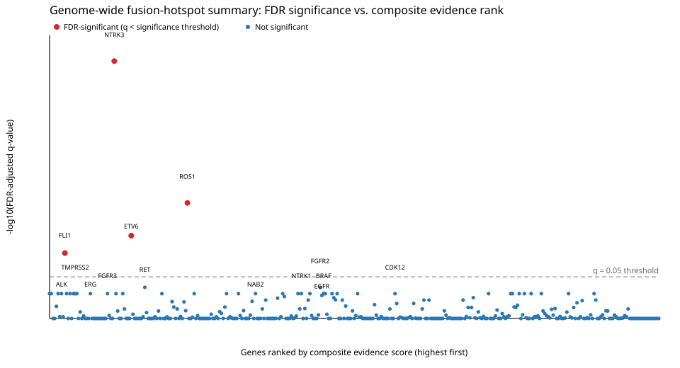

### FDR-significant and honorable-mention genes

| gene_symbol | tier | n_events_analyzed | in_frame_percent | domain_retention_percent | fisher_p_value | min_fdr_adjusted_q_value |
|---|---|---|---|---|---|---|
| NTRK3 | FDR-significant | 58 | 98.21 | 96.49 | 0.06955 | 9.002e-09 |
| ROS1 | FDR-significant | 122 | 72.73 | 90.68 | 0.214 | 0.000244 |
| ETV6 | FDR-significant | 90 | 81.01 | 77.27 | 5.123e-06 | 0.002572 |
| FLI1 | FDR-significant | 118 | 68.22 | 94.02 | 0.06871 | 0.009047 |
| RET | Honorable mention | 194 | 85.38 | 92.27 | 0.0004197 | 0.1066 |
| FGFR2 | Honorable mention | 136 | 93.1 | 85.82 | 0.0004247 | 0.1066 |
| ALK | Honorable mention | 272 | 97.41 | 96.31 | 0.001917 | 0.1675 |
| EGFR | Honorable mention | 55 | 70 | 74.55 | 0.01145 | 0.1917 |
| BRAF | Honorable mention | 179 | 92.64 | 91.57 | 0.01337 | 0.1675 |
| FGFR3 | Honorable mention | 152 | 97.37 | 94.04 | 0.01948 | 0.1675 |
| CDKN2B | Honorable mention | 12 | 66.67 | 20 | 0.02222 | 0.291 |
| IKBKE | Honorable mention | 12 | 50 | 36.36 | 0.02424 | 0.2663 |
| TMPRSS2 | Honorable mention | 867 | 33.33 | 6.243 | 0.0292 | 0.1675 |
| NTRK1 | Honorable mention | 78 | 72.73 | 84.21 | 0.04826 | 0.1675 |
| INPPL1 | Honorable mention | 14 | 57.14 | 53.85 | 0.04895 | 0.3846 |
| CDK12 | Honorable mention | 43 | 50 | 39.02 | 0.0677 | 0.1675 |
| NAB2 | Honorable mention | 72 | 71.43 | 69.01 | 0.1126 | 0.1675 |
| KDM5A | Honorable mention | 10 | 50 | 55.56 | 0.119 | 0.7728 |
| FH | Honorable mention | 16 | 16.67 | 13.33 | 0.1333 | 0.5044 |

### Gene highlights

#### NTRK3 (FDR-significant, Curated gene config)

NTRK3 was analyzed across 58 fusion events, 98.2% in-frame and 96.5% domain-retained. Domain-retention Fisher's exact test on NTRK3's own fusion events alone gives p=0.0695489 (not statistically significant at alpha=0.05). Among 359 genes scanned genome-wide in this cohort run, NTRK3's Benjamini-Hochberg-adjusted q=9.00216e-09 (reaches genome-wide FDR significance).

Full per-gene detail: [gene_reports/ntrk3/report.md](gene_reports/ntrk3/report.md)

#### ROS1 (FDR-significant, Curated gene config)

ROS1 was analyzed across 122 fusion events, 72.7% in-frame and 90.7% domain-retained. Domain-retention Fisher's exact test on ROS1's own fusion events alone gives p=0.214047 (not statistically significant at alpha=0.05). Among 359 genes scanned genome-wide in this cohort run, ROS1's Benjamini-Hochberg-adjusted q=0.00024396 (reaches genome-wide FDR significance).

Full per-gene detail: [gene_reports/ros1/report.md](gene_reports/ros1/report.md)

#### ETV6 (FDR-significant, Curated gene config)

ETV6 was analyzed across 90 fusion events, 81.0% in-frame and 77.3% domain-retained. Domain-retention Fisher's exact test on ETV6's own fusion events alone gives p=5.12326e-06 (statistically significant at alpha=0.05). The Sterile alpha motif (SAM)/Pointed domain appears to be required for retention. Among 359 genes scanned genome-wide in this cohort run, ETV6's Benjamini-Hochberg-adjusted q=0.00257187 (reaches genome-wide FDR significance).

Full per-gene detail: [gene_reports/etv6/report.md](gene_reports/etv6/report.md)

#### FLI1 (FDR-significant, Curated gene config)

FLI1 was analyzed across 118 fusion events, 68.2% in-frame and 94.0% domain-retained. Domain-retention Fisher's exact test on FLI1's own fusion events alone gives p=0.0687101 (not statistically significant at alpha=0.05). Among 359 genes scanned genome-wide in this cohort run, FLI1's Benjamini-Hochberg-adjusted q=0.00904727 (reaches genome-wide FDR significance).

Full per-gene detail: [gene_reports/fli1/report.md](gene_reports/fli1/report.md)

#### RET (Honorable mention, Curated gene config)

RET was analyzed across 194 fusion events, 85.4% in-frame and 92.3% domain-retained. Domain-retention Fisher's exact test on RET's own fusion events alone gives p=0.000419666 (statistically significant at alpha=0.05). The Protein kinase domain appears to be required for retention. Among 359 genes scanned genome-wide in this cohort run, RET's Benjamini-Hochberg-adjusted q=0.106596 (does not reach genome-wide FDR significance). The Cadherin domain appears to require loss or disruption rather than retention. Did not survive genome-wide multiple-testing correction (FDR-adjusted q-value at or above the significance threshold), but ranks highly by raw p-value among the non-FDR-significant genes and may warrant targeted follow-up. This is NOT a claim of statistical significance.

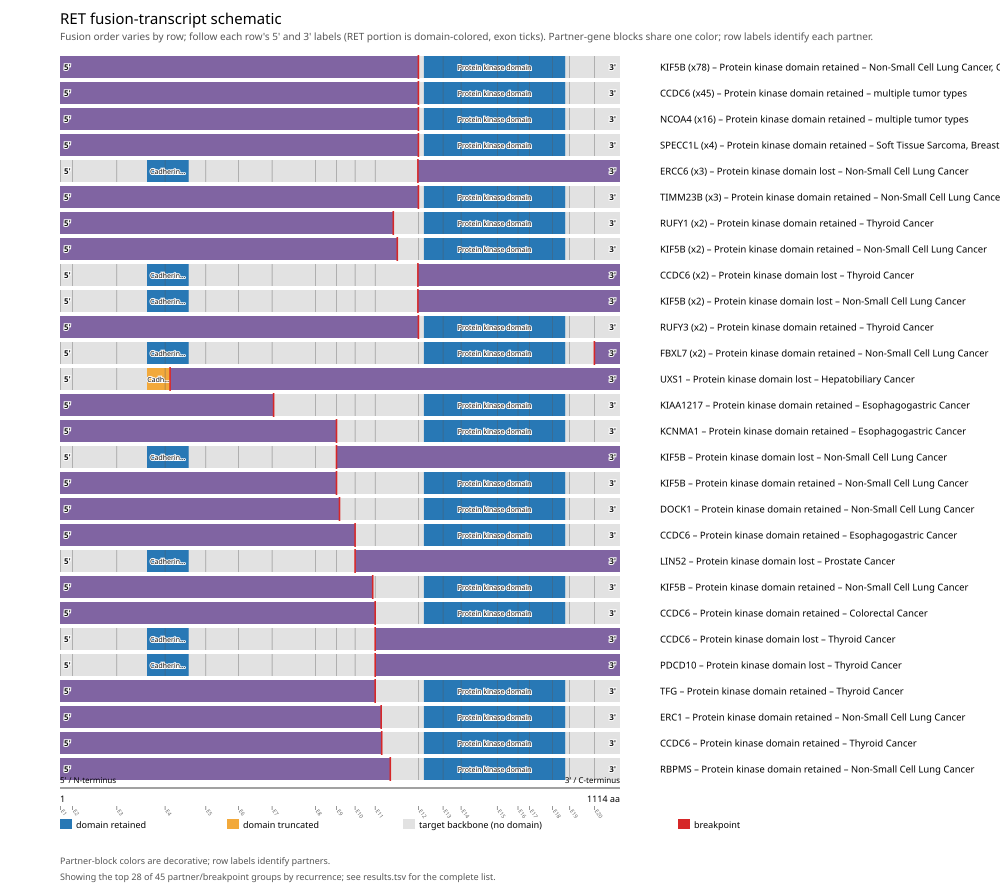

Full per-gene detail: [gene_reports/ret/report.md](gene_reports/ret/report.md)

#### FGFR2 (Honorable mention, Curated gene config)

FGFR2 was analyzed across 136 fusion events, 93.1% in-frame and 85.8% domain-retained. Domain-retention Fisher's exact test on FGFR2's own fusion events alone gives p=0.000424687 (statistically significant at alpha=0.05). The Protein kinase domain appears to be required for retention. Among 359 genes scanned genome-wide in this cohort run, FGFR2's Benjamini-Hochberg-adjusted q=0.106596 (does not reach genome-wide FDR significance). The C-terminal autoinhibitory tail (exon 18) appears to require loss or disruption rather than retention. Did not survive genome-wide multiple-testing correction (FDR-adjusted q-value at or above the significance threshold), but ranks highly by raw p-value among the non-FDR-significant genes and may warrant targeted follow-up. This is NOT a claim of statistical significance.

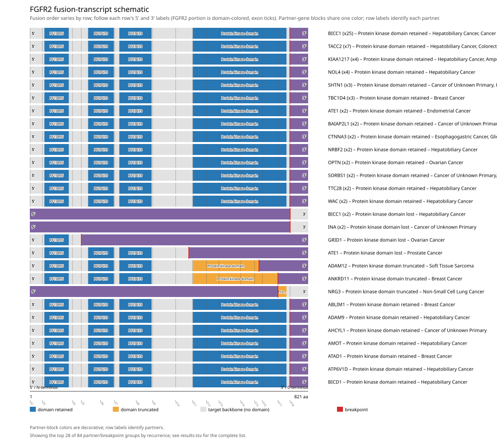

Full per-gene detail: [gene_reports/fgfr2/report.md](gene_reports/fgfr2/report.md)

#### ALK (Honorable mention, Curated gene config)

ALK was analyzed across 272 fusion events, 97.4% in-frame and 96.3% domain-retained. Domain-retention Fisher's exact test on ALK's own fusion events alone gives p=0.00191661 (statistically significant at alpha=0.05). The Protein kinase domain appears to be required for retention. Among 359 genes scanned genome-wide in this cohort run, ALK's Benjamini-Hochberg-adjusted q=0.167538 (does not reach genome-wide FDR significance). Did not survive genome-wide multiple-testing correction (FDR-adjusted q-value at or above the significance threshold), but ranks highly by raw p-value among the non-FDR-significant genes and may warrant targeted follow-up. This is NOT a claim of statistical significance.

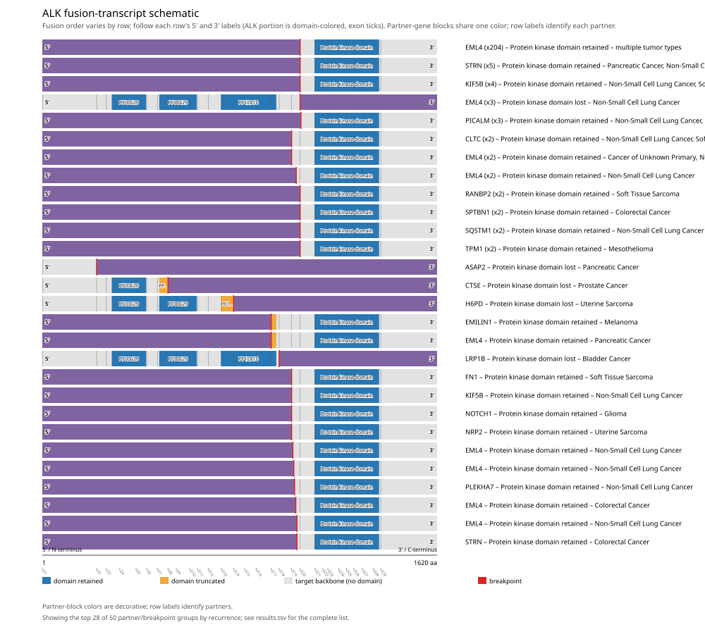

Full per-gene detail: [gene_reports/alk/report.md](gene_reports/alk/report.md)

#### EGFR (Honorable mention)

EGFR was analyzed across 55 fusion events, 70.0% in-frame and 74.5% domain-retained. Domain-retention Fisher's exact test on EGFR's own fusion events alone gives p=0.0114539 (statistically significant at alpha=0.05). The Protein tyrosine and serine/threonine kinase appears to be required for retention. Among 359 genes scanned genome-wide in this cohort run, EGFR's Benjamini-Hochberg-adjusted q=0.191661 (does not reach genome-wide FDR significance). Did not survive genome-wide multiple-testing correction (FDR-adjusted q-value at or above the significance threshold), but ranks highly by raw p-value among the non-FDR-significant genes and may warrant targeted follow-up. This is NOT a claim of statistical significance.

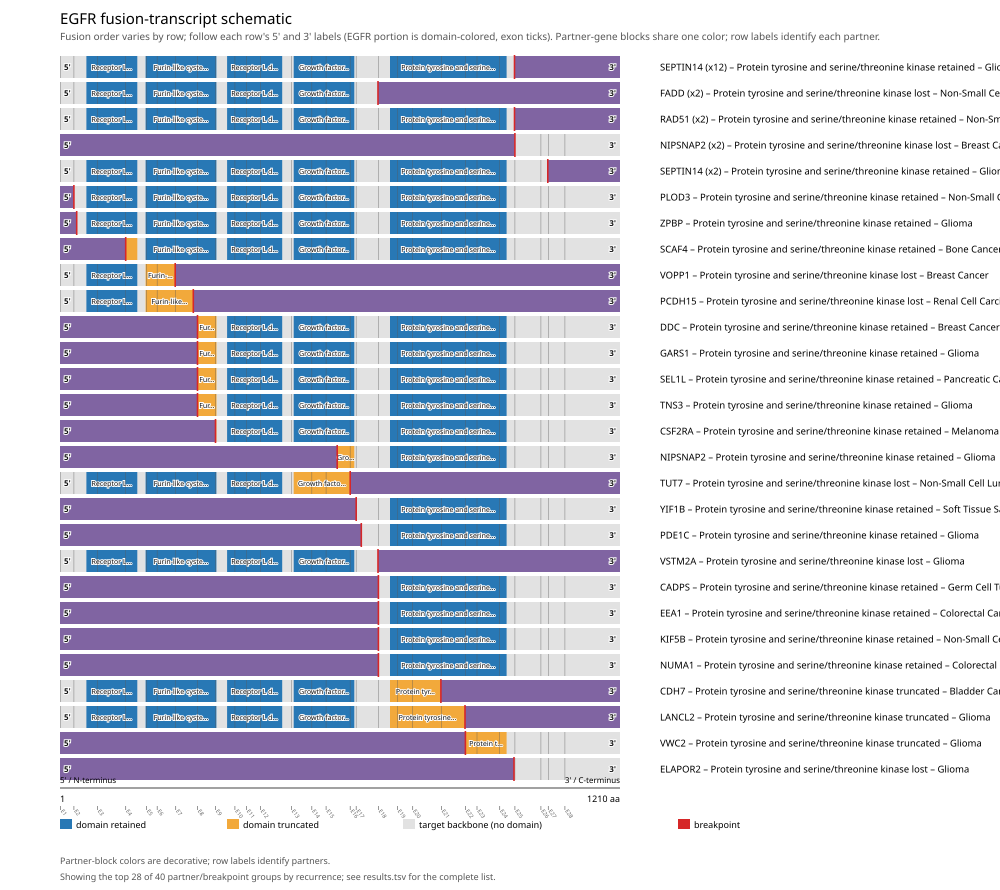

Full per-gene detail: [gene_reports/egfr/report.md](gene_reports/egfr/report.md)

#### BRAF (Honorable mention, Curated gene config)

BRAF was analyzed across 179 fusion events, 92.6% in-frame and 91.6% domain-retained. Domain-retention Fisher's exact test on BRAF's own fusion events alone gives p=0.0133676 (statistically significant at alpha=0.05). The Protein kinase domain appears to be required for retention. Among 359 genes scanned genome-wide in this cohort run, BRAF's Benjamini-Hochberg-adjusted q=0.167538 (does not reach genome-wide FDR significance). The RAS-binding domain and Cysteine-rich domain appear to require loss or disruption rather than retention. Did not survive genome-wide multiple-testing correction (FDR-adjusted q-value at or above the significance threshold), but ranks highly by raw p-value among the non-FDR-significant genes and may warrant targeted follow-up. This is NOT a claim of statistical significance.

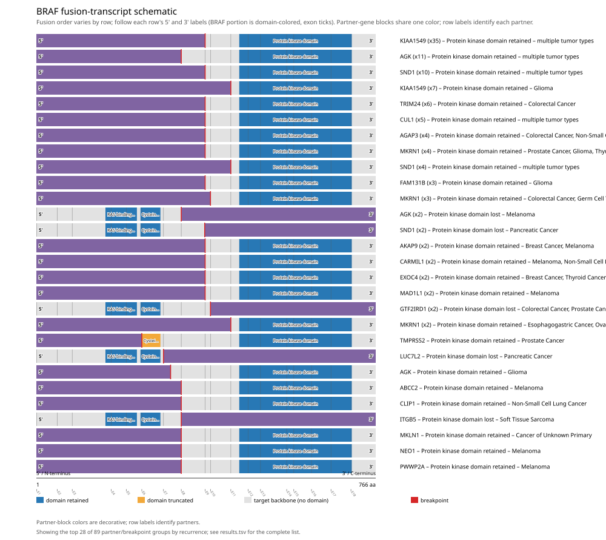

Full per-gene detail: [gene_reports/braf/report.md](gene_reports/braf/report.md)

#### FGFR3 (Honorable mention)

FGFR3 was analyzed across 152 fusion events, 97.4% in-frame and 94.0% domain-retained. Domain-retention Fisher's exact test on FGFR3's own fusion events alone gives p=0.0194824 (statistically significant at alpha=0.05). The Protein tyrosine and serine/threonine kinase appears to be required for retention. Among 359 genes scanned genome-wide in this cohort run, FGFR3's Benjamini-Hochberg-adjusted q=0.167538 (does not reach genome-wide FDR significance). Did not survive genome-wide multiple-testing correction (FDR-adjusted q-value at or above the significance threshold), but ranks highly by raw p-value among the non-FDR-significant genes and may warrant targeted follow-up. This is NOT a claim of statistical significance.

Full per-gene detail: [gene_reports/fgfr3/report.md](gene_reports/fgfr3/report.md)

#### CDKN2B (Honorable mention)

CDKN2B was analyzed across 12 fusion events, 66.7% in-frame and 20.0% domain-retained. Domain-retention Fisher's exact test on CDKN2B's own fusion events alone gives p=0.0222222 (statistically significant at alpha=0.05). Among 359 genes scanned genome-wide in this cohort run, CDKN2B's Benjamini-Hochberg-adjusted q=0.291014 (does not reach genome-wide FDR significance). Did not survive genome-wide multiple-testing correction (FDR-adjusted q-value at or above the significance threshold), but ranks highly by raw p-value among the non-FDR-significant genes and may warrant targeted follow-up. This is NOT a claim of statistical significance.

Full per-gene detail: [gene_reports/cdkn2b/report.md](gene_reports/cdkn2b/report.md)

#### IKBKE (Honorable mention)

IKBKE was analyzed across 12 fusion events, 50.0% in-frame and 36.4% domain-retained. Domain-retention Fisher's exact test on IKBKE's own fusion events alone gives p=0.0242424 (statistically significant at alpha=0.05). Among 359 genes scanned genome-wide in this cohort run, IKBKE's Benjamini-Hochberg-adjusted q=0.266266 (does not reach genome-wide FDR significance). Did not survive genome-wide multiple-testing correction (FDR-adjusted q-value at or above the significance threshold), but ranks highly by raw p-value among the non-FDR-significant genes and may warrant targeted follow-up. This is NOT a claim of statistical significance.

Full per-gene detail: [gene_reports/ikbke/report.md](gene_reports/ikbke/report.md)

#### TMPRSS2 (Honorable mention)

TMPRSS2 was analyzed across 867 fusion events, 33.3% in-frame and 6.2% domain-retained. Domain-retention Fisher's exact test on TMPRSS2's own fusion events alone gives p=0.0292045 (statistically significant at alpha=0.05). The Trypsin appears to be required for retention. Among 359 genes scanned genome-wide in this cohort run, TMPRSS2's Benjamini-Hochberg-adjusted q=0.167538 (does not reach genome-wide FDR significance). Did not survive genome-wide multiple-testing correction (FDR-adjusted q-value at or above the significance threshold), but ranks highly by raw p-value among the non-FDR-significant genes and may warrant targeted follow-up. This is NOT a claim of statistical significance.

Full per-gene detail: [gene_reports/tmprss2/report.md](gene_reports/tmprss2/report.md)

#### NTRK1 (Honorable mention, Curated gene config)

NTRK1 was analyzed across 78 fusion events, 72.7% in-frame and 84.2% domain-retained. Domain-retention Fisher's exact test on NTRK1's own fusion events alone gives p=0.0482628 (statistically significant at alpha=0.05). The Protein kinase domain appears to be required for retention. Among 359 genes scanned genome-wide in this cohort run, NTRK1's Benjamini-Hochberg-adjusted q=0.167538 (does not reach genome-wide FDR significance). Did not survive genome-wide multiple-testing correction (FDR-adjusted q-value at or above the significance threshold), but ranks highly by raw p-value among the non-FDR-significant genes and may warrant targeted follow-up. This is NOT a claim of statistical significance.

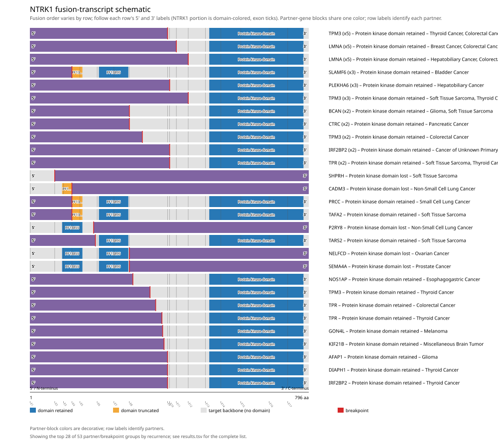

Full per-gene detail: [gene_reports/ntrk1/report.md](gene_reports/ntrk1/report.md)

#### INPPL1 (Honorable mention)

INPPL1 was analyzed across 14 fusion events, 57.1% in-frame and 53.8% domain-retained. Domain-retention Fisher's exact test on INPPL1's own fusion events alone gives p=0.048951 (statistically significant at alpha=0.05). Among 359 genes scanned genome-wide in this cohort run, INPPL1's Benjamini-Hochberg-adjusted q=0.384608 (does not reach genome-wide FDR significance). Did not survive genome-wide multiple-testing correction (FDR-adjusted q-value at or above the significance threshold), but ranks highly by raw p-value among the non-FDR-significant genes and may warrant targeted follow-up. This is NOT a claim of statistical significance.

Full per-gene detail: [gene_reports/inppl1/report.md](gene_reports/inppl1/report.md)

#### CDK12 (Honorable mention)

CDK12 was analyzed across 43 fusion events, 50.0% in-frame and 39.0% domain-retained. Domain-retention Fisher's exact test on CDK12's own fusion events alone gives p=0.0677006 (not statistically significant at alpha=0.05). Among 359 genes scanned genome-wide in this cohort run, CDK12's Benjamini-Hochberg-adjusted q=0.167538 (does not reach genome-wide FDR significance). Did not survive genome-wide multiple-testing correction (FDR-adjusted q-value at or above the significance threshold), but ranks highly by raw p-value among the non-FDR-significant genes and may warrant targeted follow-up. This is NOT a claim of statistical significance.

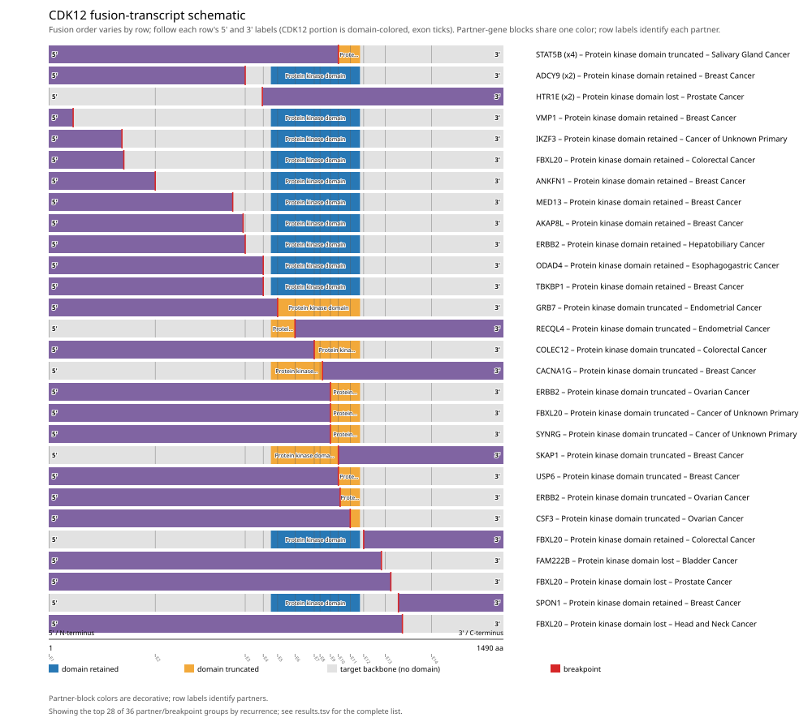

Full per-gene detail: [gene_reports/cdk12/report.md](gene_reports/cdk12/report.md)

#### NAB2 (Honorable mention)

NAB2 was analyzed across 72 fusion events, 71.4% in-frame and 69.0% domain-retained. Domain-retention Fisher's exact test on NAB2's own fusion events alone gives p=0.11258 (not statistically significant at alpha=0.05). Among 359 genes scanned genome-wide in this cohort run, NAB2's Benjamini-Hochberg-adjusted q=0.167538 (does not reach genome-wide FDR significance). Did not survive genome-wide multiple-testing correction (FDR-adjusted q-value at or above the significance threshold), but ranks highly by raw p-value among the non-FDR-significant genes and may warrant targeted follow-up. This is NOT a claim of statistical significance.

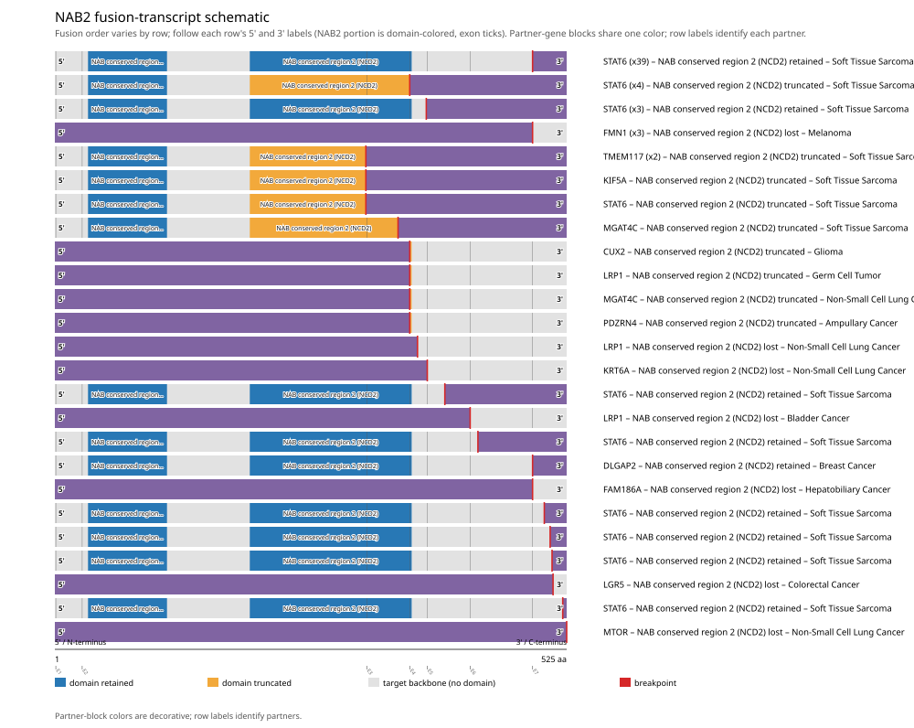

Full per-gene detail: [gene_reports/nab2/report.md](gene_reports/nab2/report.md)

#### KDM5A (Honorable mention)

KDM5A was analyzed across 10 fusion events, 50.0% in-frame and 55.6% domain-retained. Domain-retention Fisher's exact test on KDM5A's own fusion events alone gives p=0.119048 (not statistically significant at alpha=0.05). Among 359 genes scanned genome-wide in this cohort run, KDM5A's Benjamini-Hochberg-adjusted q=0.772783 (does not reach genome-wide FDR significance). Did not survive genome-wide multiple-testing correction (FDR-adjusted q-value at or above the significance threshold), but ranks highly by raw p-value among the non-FDR-significant genes and may warrant targeted follow-up. This is NOT a claim of statistical significance.

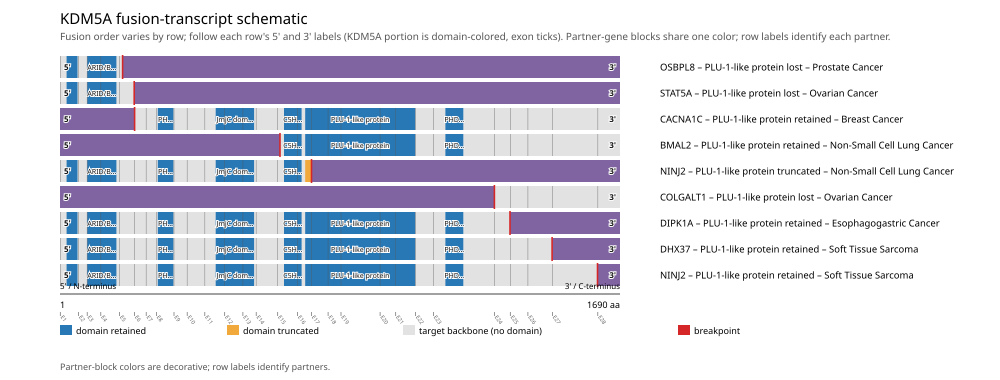

Full per-gene detail: [gene_reports/kdm5a/report.md](gene_reports/kdm5a/report.md)

#### FH (Honorable mention)

FH was analyzed across 16 fusion events, 16.7% in-frame and 13.3% domain-retained. Domain-retention Fisher's exact test on FH's own fusion events alone gives p=0.133333 (not statistically significant at alpha=0.05). Among 359 genes scanned genome-wide in this cohort run, FH's Benjamini-Hochberg-adjusted q=0.504448 (does not reach genome-wide FDR significance). Did not survive genome-wide multiple-testing correction (FDR-adjusted q-value at or above the significance threshold), but ranks highly by raw p-value among the non-FDR-significant genes and may warrant targeted follow-up. This is NOT a claim of statistical significance.

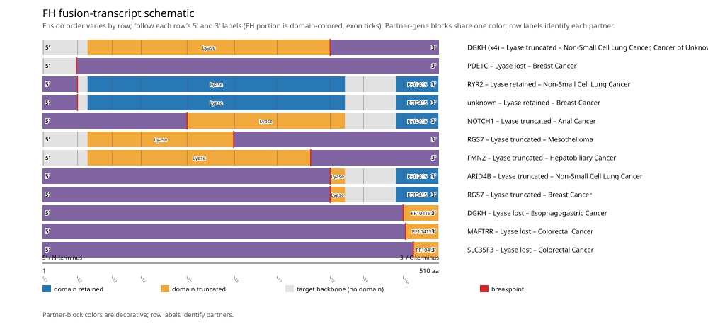

Full per-gene detail: [gene_reports/fh/report.md](gene_reports/fh/report.md)

#### ERG (Curated gene config)

ERG was analyzed across 788 fusion events, 33.0% in-frame and 97.7% domain-retained. Domain-retention Fisher's exact test on ERG's own fusion events alone gives p=0.846156 (not statistically significant at alpha=0.05). Among 359 genes scanned genome-wide in this cohort run, ERG's Benjamini-Hochberg-adjusted q=0.167538 (does not reach genome-wide FDR significance).

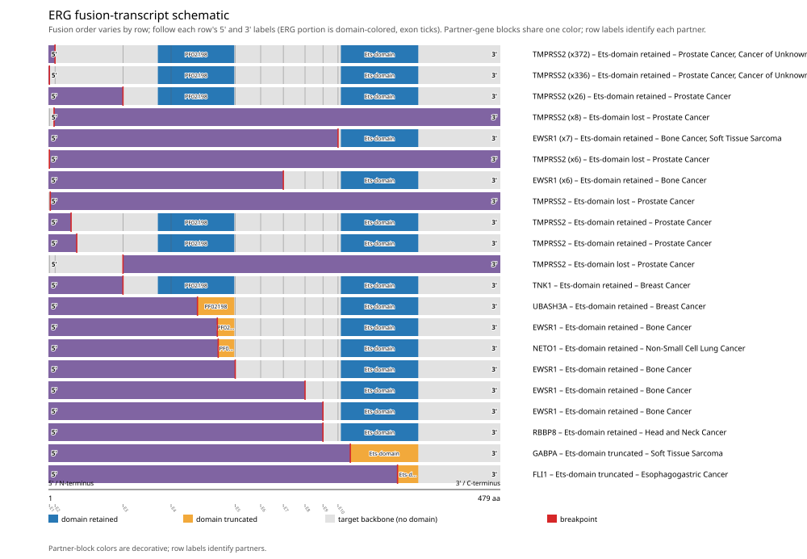

Full per-gene detail: [gene_reports/erg/report.md](gene_reports/erg/report.md)

## Discussion

- Cross-gene Benjamini-Hochberg FDR correction was applied jointly across the 359 genes that produced at least one computable p-value in this scan. This reduces false-positive findings relative to testing each gene in isolation, but is a conservative correction: a real per-gene effect can fail to reach the q < 0.05 threshold once corrected across that full p-value-bearing gene set.
- 10 gene(s) used hand-curated gene configurations, while 514 gene(s) were auto-configured from Genome Nexus canonical-transcript/Pfam-domain data using a kinase/catalytic-keyword heuristic to select the tracked domain; auto-configured domains have not been manually verified the way hand-curated ones have.
- Data were retrieved live from the public msk_impact_50k_2026 cBioPortal study as of 2026-09-15T16:38:12.426581+00:00. Some cBioPortal cohorts (e.g. actively accruing clinical-sequencing panels such as MSK-IMPACT) are updated periodically, so exact counts could shift if this scan is re-run later against such a cohort.
- All findings in this manuscript are computational, hypothesis-generating candidate evidence from bioinformatic analysis of public cohort data, not validated clinical calls; a gene's presence here is not a therapeutic or diagnostic recommendation.

## Appendix: per-gene report index

| gene_symbol | tier | config_source | n_events_analyzed | min_fdr_adjusted_q_value | report |
|---|---|---|---|---|---|
| NTRK3 | FDR-significant; Curated gene config | curated | 58 | 9.002e-09 | [gene_reports/ntrk3/report.md](gene_reports/ntrk3/report.md) |
| ROS1 | FDR-significant; Curated gene config | curated | 122 | 0.000244 | [gene_reports/ros1/report.md](gene_reports/ros1/report.md) |
| ETV6 | FDR-significant; Curated gene config | curated | 90 | 0.002572 | [gene_reports/etv6/report.md](gene_reports/etv6/report.md) |
| FLI1 | FDR-significant; Curated gene config | curated | 118 | 0.009047 | [gene_reports/fli1/report.md](gene_reports/fli1/report.md) |
| RET | Honorable mention; Curated gene config | curated | 194 | 0.1066 | [gene_reports/ret/report.md](gene_reports/ret/report.md) |
| FGFR2 | Honorable mention; Curated gene config | curated | 136 | 0.1066 | [gene_reports/fgfr2/report.md](gene_reports/fgfr2/report.md) |
| ALK | Honorable mention; Curated gene config | curated | 272 | 0.1675 | [gene_reports/alk/report.md](gene_reports/alk/report.md) |
| EGFR | Honorable mention | auto | 55 | 0.1917 | [gene_reports/egfr/report.md](gene_reports/egfr/report.md) |
| BRAF | Honorable mention; Curated gene config | curated | 179 | 0.1675 | [gene_reports/braf/report.md](gene_reports/braf/report.md) |
| FGFR3 | Honorable mention | auto | 152 | 0.1675 | [gene_reports/fgfr3/report.md](gene_reports/fgfr3/report.md) |
| CDKN2B | Honorable mention | auto | 12 | 0.291 | [gene_reports/cdkn2b/report.md](gene_reports/cdkn2b/report.md) |
| IKBKE | Honorable mention | auto | 12 | 0.2663 | [gene_reports/ikbke/report.md](gene_reports/ikbke/report.md) |
| TMPRSS2 | Honorable mention | auto | 867 | 0.1675 | [gene_reports/tmprss2/report.md](gene_reports/tmprss2/report.md) |
| NTRK1 | Honorable mention; Curated gene config | curated | 78 | 0.1675 | [gene_reports/ntrk1/report.md](gene_reports/ntrk1/report.md) |
| INPPL1 | Honorable mention | auto | 14 | 0.3846 | [gene_reports/inppl1/report.md](gene_reports/inppl1/report.md) |
| CDK12 | Honorable mention | auto | 43 | 0.1675 | [gene_reports/cdk12/report.md](gene_reports/cdk12/report.md) |
| NAB2 | Honorable mention | auto | 72 | 0.1675 | [gene_reports/nab2/report.md](gene_reports/nab2/report.md) |
| KDM5A | Honorable mention | auto | 10 | 0.7728 | [gene_reports/kdm5a/report.md](gene_reports/kdm5a/report.md) |
| FH | Honorable mention | auto | 16 | 0.5044 | [gene_reports/fh/report.md](gene_reports/fh/report.md) |
| ERG | Curated gene config | curated | 788 | 0.1675 | [gene_reports/erg/report.md](gene_reports/erg/report.md) |
