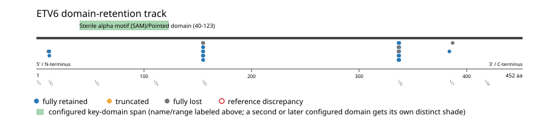
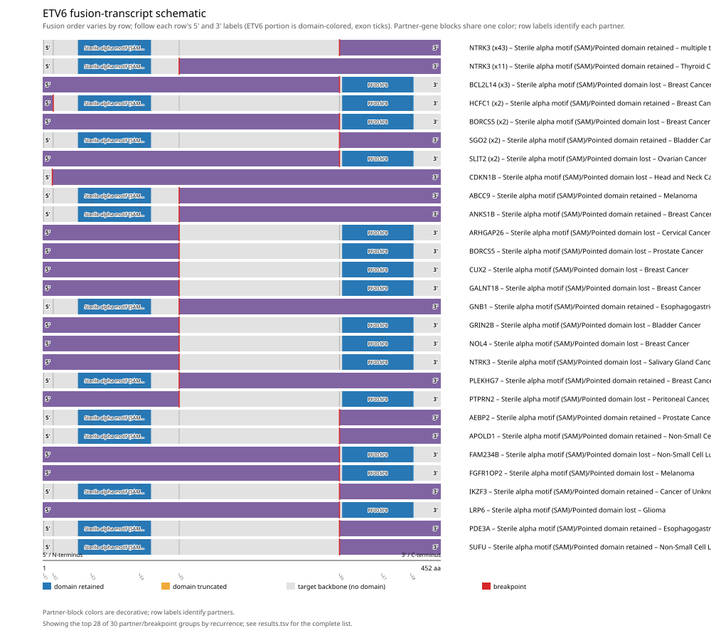
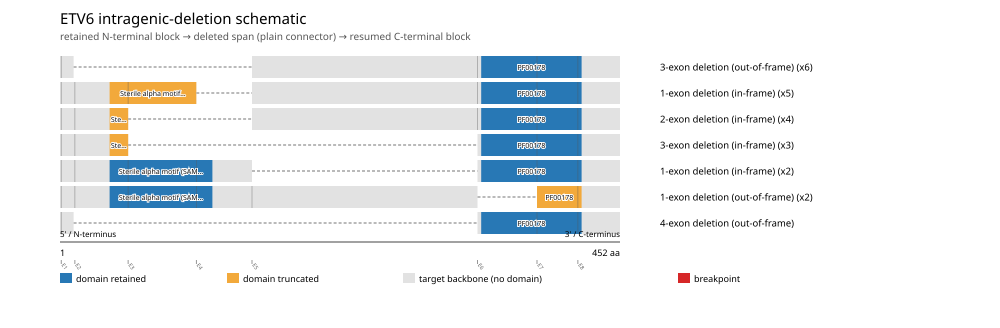

# ETV6 real-data fusion benchmark: msk_impact_50k_2026

Retrieved from public cBioPortal and Genome Nexus on 2026-09-15.

## Results

- Structural variants returned for ETV6: 214
- Protein-fusion records found: 90
- Protein-fusion records mapped: 88
- Malformed/unmappable fusion records skipped: 2
- In-frame among known-frame events: 64/79 (81.0%)
- Unknown frame status: 9/88
- Sterile alpha motif (SAM)/Pointed domain (40-123 aa) retained: 68/88 (77.3%)
- In-frame and Sterile alpha motif (SAM)/Pointed domain-retained: 58/64
- Fisher exact test (one-sided): odds ratio 13.5333, p=5.12326e-06
- Breakpoint-permutation empirical p-value: 0.000999001
- Contingency table `[[retained/in-frame, retained/other], [not-retained/in-frame, not-retained/other]]`: `[[58, 10], [6, 14]]`

The Sterile alpha motif (SAM)/Pointed domain appears to be required for retention.

- Mutation/CNA co-occurrence: not computed (ETV6 has no mutual_exclusivity_targets configured; co-occurrence/mutual-exclusivity analysis was skipped.)

### Mechanistic interpretation

**Curated mechanism:** ETV6 is typically the *partner*, not the target, in its recurrent fusions -- it contributes an oligomerization module rather than being itself the kinase/effector under domain-retention selection. Retention of ETV6's SAM/Pointed domain lets the fusion protein head-to-tail self-polymerize; in ETV6-NTRK3, single-residue mutagenesis at the SAM polymer interface (Lys-99/Asp-101) shows this native polymeric assembly -- not merely forced proximity of two kinase domains -- is what is required to force NTRK3 kinase trans-autophosphorylation/activation independent of ligand; substituting an unrelated dimerization module for the SAM domain preserves kinase activation but still fails to transform. In ETV6-RUNX1/ETV6-PDGFRB and related fusions, the same SAM-domain oligomerization instead drives constitutive activity of a transcription factor or a different kinase. The shared mechanistic thread is oligomerization, not a target-kinase-specific autoinhibition mechanism.

**Sterile alpha motif (SAM)/Pointed domain retention:** statistically supported (p=5.12326e-06, odds ratio=13.5333), but 6/64 in-frame events (9.4%) show the opposite status.

BCL2L14 (x2), BORCS5 (x2) recur among just these counter-intuitive events -- a candidate subgroup that may follow a distinct, not-yet-curated mechanism. This is flagged for manual curator review, not asserted as a confirmed alternate mechanism.

| Event | Sample | Partner | Breakpoint (aa) | Status |
|---|---|---|---:|---|
| EVT-P-0051300-T01-IM6-4 | P-0051300-T01-IM6 | BCL2L14 | 337 | lost |
| EVT-P-0040855-T01-IM6-5 | P-0040855-T01-IM6 | BCL2L14 | 337 | lost |
| EVT-P-0015724-T01-IM6-6 | P-0015724-T01-IM6 | BORCS5 | 337 | lost |
| EVT-P-0033635-T01-IM6-23 | P-0033635-T01-IM6 | BORCS5 | 155 | lost |
| EVT-P-0022579-T01-IM6-121 | P-0022579-T01-IM6 | FAM234B | 337 | lost |
| EVT-P-0007772-T02-IM5-176 | P-0007772-T02-IM5 | NTRK3 | 155 | lost |

### Domain retention and discrepancies

*Domain-retention positions for analyzed fusion events; red outlines mark reference discrepancies.*

### Fusion-transcript schematic

*One row per recurrent partner/breakpoint group, sharing one amino-acid x-axis for ETV6's full protein length; the partner-contributed portion is colored per partner, the retained target-gene portion is colored by domain-retention status, and a red line marks the breakpoint.*

### Intragenic-deletion schematic

*Same-gene (Site1==Site2==ETV6) intragenic-deletion-style SV records: a retained N-terminal block, a plain connector line for the deleted span, and a resumed C-terminal block.*

## Method

The cBioPortal `msk_impact_50k_2026_structural_variants` structural-variant profile was queried by the configured Entrez gene ID. Fusion-annotated records were adapted to the production SV schema and normalized; when `site2EffectOnFrame=NA`, frame status was resolved from `Event_Info`, not copied into `FusionEvent.Frame_status`.

ETV6 genomic breakpoints were mapped against the Genome Nexus canonical transcript, and retention was classified against its returned Sterile alpha motif (SAM)/Pointed domain coordinates. Counts are event-level with no patient deduplication. In-frame percentage uses only events explicitly called in-frame or out-of-frame; unknown-frame events are reported separately and excluded from that denominator. The Fisher comparison's `other` column combines out-of-frame and unknown-frame events, as pre-specified by the domain-retention algorithm.

For each fusion, breakpoint selection preferred the Genome Nexus canonical transcript's exon-spanned target locus over cBioPortal site labels; malformed rows with no unambiguous target-locus coordinate were skipped and listed in Warnings.

## Full-suite highlights

- Registered algorithms executed: composite_score, confidence_stats, cutpoint_detection, domain_disruption, domain_retention, exon_retention, expression_association, frequency, genomic_position_recurrence, joint_partner, mechanistic_interpretation, mutation_cooccurrence, window_detection
- Cutpoint detection: inferred breakpoint 155 aa (exon 4/5 boundary); corrected permutation p=0.163836.
- Genomic-position recurrence: The 23 events sharing protein position 155 aa use 22 distinct genomic positions spanning 14154 bp -- the protein-position recurrence is broader than any single genomic hotspot, consistent with independent intronic breakpoints mapped (or clamped) onto the same protein/exon boundary rather than one shared DNA lesion.
- Top composite score: NTRK3 (55 events), 0.479986.
- Expression association: No mRNA expression data was available for ETV6 in this cohort; expression-association analysis was skipped.

## Partners

ABCC9 (1), AEBP2 (1), ANKS1B (1), APOLD1 (1), ARHGAP26 (1), BCL2L14 (3), BORCS5 (3), CCND2 (2), CDKN1B (1), CUX2 (1), FAM234B (1), FGFR1OP2 (1), GALNT18 (1), GNB1 (1), GRIN2B (1), HCFC1 (2), IKZF3 (1), LRP6 (1), NOL4 (1), NTRK3 (55), PDE3A (1), PLEKHG7 (1), PPIL2 (2), PTPRN2 (1), SGO2 (2), SLIT2 (2), SUFU (1)

## Warnings

- Skipped EVT-P-0055462-T01-IM6-7 (CCND2-ETV6): ValueError: could not determine 5'/3' role for ETV6 in EVT-P-0055462-T01-IM6-7; Event_Info='Antisense Fusion'
- Skipped EVT-P-0019604-T01-IM6-8 (CCND2-ETV6): ValueError: could not determine 5'/3' role for ETV6 in EVT-P-0019604-T01-IM6-8; Event_Info='Antisense Fusion'

## Interpretation

These values describe the live study named above.
