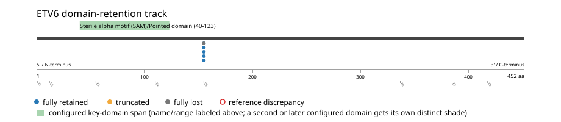
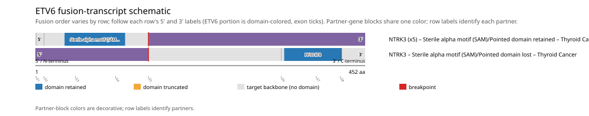

# ETV6 real-data fusion benchmark: thca_tcga_pan_can_atlas_2018

Retrieved from public cBioPortal and Genome Nexus on 2026-09-10.

## Results

- Structural variants returned for ETV6: 6
- Protein-fusion records found: 6
- Protein-fusion records mapped: 6
- Malformed/unmappable fusion records skipped: 0
- In-frame: 6/6 (100.0%)
- Sterile alpha motif (SAM)/Pointed domain (40-123 aa) retained: 5/6 (83.3%)
- In-frame and Sterile alpha motif (SAM)/Pointed domain-retained: 5/6
- Fisher exact test (one-sided): odds ratio unavailable, p=1
- Breakpoint-permutation empirical p-value: 1
- Contingency table `[[retained/in-frame, retained/other], [not-retained/in-frame, not-retained/other]]`: `[[5, 0], [1, 0]]`

- Mutation/CNA co-occurrence: not computed (ETV6 has no mutual_exclusivity_targets configured; co-occurrence/mutual-exclusivity analysis was skipped.)

### Domain retention and discrepancies

*Domain-retention positions for analyzed fusion events; red outlines mark reference discrepancies.*

### Fusion-transcript schematic

*One row per recurrent partner/breakpoint group, sharing one amino-acid x-axis for ETV6's full protein length; the partner-contributed portion is colored per partner, the retained target-gene portion is colored by domain-retention status, and a red line marks the breakpoint.*

## Method

The cBioPortal `thca_tcga_pan_can_atlas_2018_structural_variants` structural-variant profile was queried by the configured Entrez gene ID. Fusion-annotated records were adapted to the production SV schema and normalized; when `site2EffectOnFrame=NA`, frame status was resolved from `Event_Info`, not copied into `FusionEvent.Frame_status`.

ETV6 genomic breakpoints were mapped against the Genome Nexus canonical transcript, and retention was classified against its returned Sterile alpha motif (SAM)/Pointed domain coordinates. Counts are event-level with no patient deduplication. The Fisher comparison's `other` column combines out-of-frame and unknown-frame events, as pre-specified by the domain-retention algorithm.

For each fusion, breakpoint selection preferred the Genome Nexus canonical transcript's exon-spanned target locus over cBioPortal site labels; malformed rows with no unambiguous target-locus coordinate were skipped and listed in Warnings.

## Full-suite highlights

- Registered algorithms executed: composite_score, confidence_stats, cutpoint_detection, domain_disruption, domain_retention, exon_retention, expression_association, frequency, genomic_position_recurrence, joint_partner, mutation_cooccurrence, window_detection
- Cutpoint detection: not determinable (fewer than 2 distinct breakpoint positions to scan).
- Genomic-position recurrence: The 6 events sharing protein position 155 aa use 2 distinct genomic positions spanning 15863 bp -- the protein-position recurrence is broader than any single genomic hotspot, consistent with independent intronic breakpoints mapped (or clamped) onto the same protein/exon boundary rather than one shared DNA lesion.
- Top composite score: NTRK3 (6 events), 0.520928.
- Expression association: ETV6 mRNA expression is not significantly lower in fusion-positive samples (n=5) than fusion-negative samples (n=493) (mann_whitney_u, p=0.801).

## Partners

NTRK3 (6)

## Interpretation

These values describe the live study named above.
