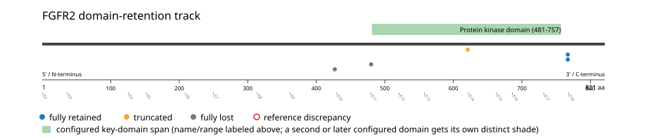
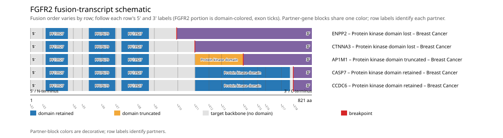

# FGFR2 real-data fusion benchmark: brca_tcga_pan_can_atlas_2018

Retrieved from public cBioPortal and Genome Nexus on 2026-09-10.

## Results

- Structural variants returned for FGFR2: 5
- Protein-fusion records found: 5
- Protein-fusion records mapped: 5
- Malformed/unmappable fusion records skipped: 0
- In-frame: 4/5 (80.0%)
- Protein kinase domain (481-757 aa) retained: 2/5 (40.0%)
- In-frame and Protein kinase domain-retained: 2/4
- Fisher exact test (one-sided): odds ratio unavailable, p=0.6
- Breakpoint-permutation empirical p-value: 0.020979
- Contingency table `[[retained/in-frame, retained/other], [not-retained/in-frame, not-retained/other]]`: `[[2, 0], [2, 1]]`

- FGFR2 fusions are not significantly associated with FGFR2 point_mutation (S252W) across 1084 cohort samples and show no directional tendency relative to it (2x2 table [[0, 5], [0, 1079]]; odds ratio unavailable, Fisher's exact two-sided p=1).

### Domain retention and discrepancies

*Domain-retention positions for analyzed fusion events; red outlines mark reference discrepancies.*

### Fusion-transcript schematic

*One row per recurrent partner/breakpoint group, sharing one amino-acid x-axis for FGFR2's full protein length; the partner-contributed portion is colored per partner, the retained target-gene portion is colored by domain-retention status, and a red line marks the breakpoint.*

## Method

The cBioPortal `brca_tcga_pan_can_atlas_2018_structural_variants` structural-variant profile was queried by the configured Entrez gene ID. Fusion-annotated records were adapted to the production SV schema and normalized; when `site2EffectOnFrame=NA`, frame status was resolved from `Event_Info`, not copied into `FusionEvent.Frame_status`.

FGFR2 genomic breakpoints were mapped against the Genome Nexus canonical transcript, and retention was classified against its returned Protein kinase domain coordinates. Counts are event-level with no patient deduplication. The Fisher comparison's `other` column combines out-of-frame and unknown-frame events, as pre-specified by the domain-retention algorithm.

For each fusion, breakpoint selection preferred the Genome Nexus canonical transcript's exon-spanned target locus over cBioPortal site labels; malformed rows with no unambiguous target-locus coordinate were skipped and listed in Warnings.

## Full-suite highlights

- Registered algorithms executed: composite_score, confidence_stats, cutpoint_detection, domain_disruption, domain_retention, exon_retention, expression_association, frequency, genomic_position_recurrence, joint_partner, mutation_cooccurrence, window_detection
- Cutpoint detection: inferred breakpoint 621 aa (exon 13); corrected permutation p=0.200799.
- Genomic-position recurrence: All 2 events sharing protein position 767 aa share the exact same genomic breakpoint -- consistent with a real DNA-level recurrent breakpoint, not just a protein-coordinate coincidence.
- Top composite score: AP1M1 (1 events), 0.357742.
- Expression association: FGFR2 mRNA expression is significantly higher in fusion-positive samples (n=5) than fusion-negative samples (n=1077) (mann_whitney_u, p=0.0196). Among fusion-positive samples, FGFR2 expression is not significantly lower in kinase-domain-retained fusions (n=2) than not-retained fusions (n=3) (mann_whitney_u, p=0.2).

## Partners

AP1M1 (1), CASP7 (1), CCDC6 (1), CTNNA3 (1), ENPP2 (1)

## Interpretation

These values describe the live study named above.
