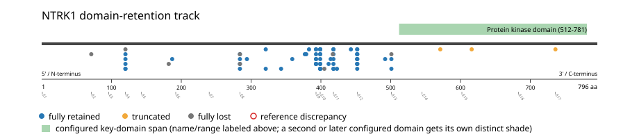
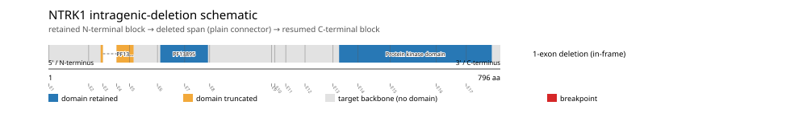

# NTRK1 real-data fusion benchmark: msk_impact_50k_2026

Retrieved from public cBioPortal and Genome Nexus on 2026-09-15.

## Results

- Structural variants returned for NTRK1: 118
- Protein-fusion records found: 78
- Protein-fusion records mapped: 76
- Malformed/unmappable fusion records skipped: 2
- In-frame among known-frame events: 32/44 (72.7%)
- Unknown frame status: 32/76
- Protein kinase domain (512-781 aa) retained: 64/76 (84.2%)
- In-frame and Protein kinase domain-retained: 30/32
- Fisher exact test (one-sided): odds ratio 4.41176, p=0.0482628
- Breakpoint-permutation empirical p-value: 0.000999001
- Contingency table `[[retained/in-frame, retained/other], [not-retained/in-frame, not-retained/other]]`: `[[30, 34], [2, 10]]`

The Protein kinase domain appears to be required for retention.

- Mutation/CNA co-occurrence: not computed (NTRK1 has no mutual_exclusivity_targets configured; co-occurrence/mutual-exclusivity analysis was skipped.)

### Mechanistic interpretation

**Curated mechanism:** Combined loss of ligand-binding autoinhibition plus partner-driven dimerization. Wild-type NTRK1/TRKA requires NGF binding to its extracellular Ig-like domains to dimerize and autophosphorylate; engineered TRKA variants lacking that region (the TRKA-III splice variant, and a single P203A substitution within Ig1) are spontaneously dimerizing and transforming even without a fusion partner, indicating the deleted ectodomain is restraining, not merely permissive. No disruption_required_domains target is configured for this gene because no supported Pfam accession marks that specific restraining region -- a data-availability gap, not a mechanism gap. The fusion partner's own coiled-coil (e.g. LMNA's alpha-helical rod, TPM3's) then supplies the second, partner-driven half of the mechanism: forcing ligand-independent dimerization and trans-autophosphorylation of the retained kinase domain.

**Protein kinase domain retention:** statistically supported (p=0.0482628, odds ratio=4.41176), but 2/32 in-frame events (6.2%) show the opposite status.

Spread across distinct partner genes with no partner recurring 2+ times among them -- consistent with background noise or individual passenger events rather than a distinct recurrent subgroup; too weak to infer an alternate mechanism from this cohort alone.

| Event | Sample | Partner | Breakpoint (aa) | Status |
|---|---|---|---:|---|
| EVT-P-0055952-T01-IM6-6 | P-0055952-T01-IM6 | COP1 | 736 | disrupted |
| EVT-P-0024231-T01-IM6-33 | P-0024231-T01-IM6 | MEF2D | 501 | lost |

### Domain retention and discrepancies

*Domain-retention positions for analyzed fusion events; red outlines mark reference discrepancies.*

### Fusion-transcript schematic

*One row per recurrent partner/breakpoint group, sharing one amino-acid x-axis for NTRK1's full protein length; the partner-contributed portion is colored per partner, the retained target-gene portion is colored by domain-retention status, and a red line marks the breakpoint.*

### Intragenic-deletion schematic

*Same-gene (Site1==Site2==NTRK1) intragenic-deletion-style SV records: a retained N-terminal block, a plain connector line for the deleted span, and a resumed C-terminal block.*

## Method

The cBioPortal `msk_impact_50k_2026_structural_variants` structural-variant profile was queried by the configured Entrez gene ID. Fusion-annotated records were adapted to the production SV schema and normalized; when `site2EffectOnFrame=NA`, frame status was resolved from `Event_Info`, not copied into `FusionEvent.Frame_status`.

NTRK1 genomic breakpoints were mapped against the Genome Nexus canonical transcript, and retention was classified against its returned Protein kinase domain coordinates. Counts are event-level with no patient deduplication. In-frame percentage uses only events explicitly called in-frame or out-of-frame; unknown-frame events are reported separately and excluded from that denominator. The Fisher comparison's `other` column combines out-of-frame and unknown-frame events, as pre-specified by the domain-retention algorithm.

For each fusion, breakpoint selection preferred the Genome Nexus canonical transcript's exon-spanned target locus over cBioPortal site labels; malformed rows with no unambiguous target-locus coordinate were skipped and listed in Warnings.

## Full-suite highlights

- Registered algorithms executed: composite_score, confidence_stats, cutpoint_detection, domain_disruption, domain_retention, exon_retention, expression_association, frequency, genomic_position_recurrence, joint_partner, mechanistic_interpretation, mutation_cooccurrence, window_detection
- Cutpoint detection: inferred breakpoint 501 aa (exon 12/13 boundary); corrected permutation p=0.014985.
- Genomic-position recurrence: The 3 events sharing protein position 501 aa use 3 distinct genomic positions spanning 254 bp -- the protein-position recurrence is broader than any single genomic hotspot, consistent with independent intronic breakpoints mapped (or clamped) onto the same protein/exon boundary rather than one shared DNA lesion.
- Top composite score: LMNA (12 events), 0.38891.
- Expression association: No mRNA expression data was available for NTRK1 in this cohort; expression-association analysis was skipped.

## Partners

AFAP1 (1), ANKRD36 (1), ARHGEF11 (2), ATP1A2 (1), BCAN (2), CADM3 (1), COP1 (1), CTRC (2), DDR2 (1), DIAPH1 (1), EML4 (1), EPS15 (1), F11R (1), GON4L (1), IQGAP3 (1), IRF2BP2 (3), KIF21B (1), LMNA (12), LTAP1 (1), MEF2D (1), METTL25B (1), NELFCD (1), NOS1AP (1), P2RY8 (1), PEAR1 (1), PLEKHA6 (3), PRCC (1), RAB25 (1), RABGAP1L (1), SCP2 (1), SEMA4A (1), SHPRH (1), SLAMF6 (3), SMYD2 (1), STK11 (1), TAFA2 (1), TARS2 (1), TPM3 (12), TPR (5), TRIM63 (1), TRPM8 (1), VANGL2 (1), ZBTB7B (1)

## Warnings

- Skipped EVT-P-0022046-T01-IM6-34 (METTL25B-NTRK1): ValueError: could not determine 5'/3' role for NTRK1 in EVT-P-0022046-T01-IM6-34; Event_Info='Antisense Fusion'
- Skipped EVT-P-0008246-T02-IM5-40 (NTRK1-DDR2): ValueError: could not determine 5'/3' role for NTRK1 in EVT-P-0008246-T02-IM5-40; Event_Info='Antisense fusion'

## Interpretation

LMNA and TPM3 each occur in 12/78 and 12/78 events, respectively; 30/32 in-frame events retain PF07714. This is directionally consistent with LMNA-NTRK1/TPM3-NTRK1 biology, while the all-event in-frame percentage is reported as observed rather than treated as a literature replication.
