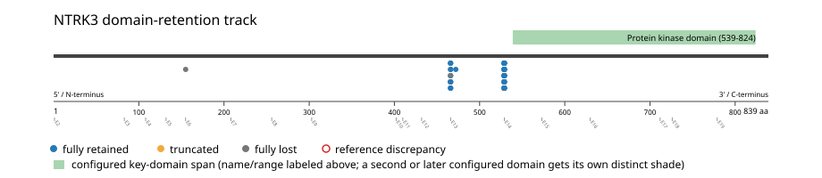
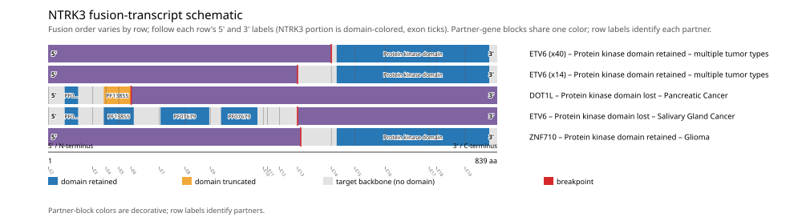
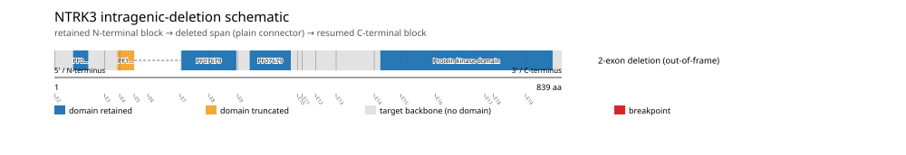

# NTRK3 real-data fusion benchmark: msk_impact_50k_2026

Retrieved from public cBioPortal and Genome Nexus on 2026-09-15.

## Results

- Structural variants returned for NTRK3: 71
- Protein-fusion records found: 58
- Protein-fusion records mapped: 57
- Malformed/unmappable fusion records skipped: 1
- In-frame among known-frame events: 55/56 (98.2%)
- Unknown frame status: 1/57
- Protein kinase domain (539-824 aa) retained: 55/57 (96.5%)
- In-frame and Protein kinase domain-retained: 54/55
- Fisher exact test (one-sided): odds ratio 54, p=0.0695489
- Breakpoint-permutation empirical p-value: 0.000999001
- Contingency table `[[retained/in-frame, retained/other], [not-retained/in-frame, not-retained/other]]`: `[[54, 1], [1, 1]]`

- Mutation/CNA co-occurrence: not computed (NTRK3 has no mutual_exclusivity_targets configured; co-occurrence/mutual-exclusivity analysis was skipped.)

### Mechanistic interpretation

**Curated mechanism:** Partner-driven oligomerization via ETV6's SAM (pointed/PNT) domain is the dominant mechanism, operating on a permissive background of ligand-domain loss. The t(12;15) breakpoint severs NTRK3 upstream of the kinase domain, discarding the entire extracellular NT-3-binding region and transmembrane segment (eliminating ligand dependence and membrane anchoring) while retaining the kinase domain intact. ETV6's SAM domain, retained at the N-terminus of the chimera, then drives head-to-tail self-polymerization; this polymeric assembly -- not simply forced proximity of two kinase domains -- is required for trans-autophosphorylation and transformation. The chimera is not a transcription factor: ETV6's own ETS DNA-binding domain is lost, and this is not a promoter-swap/overexpression mechanism.

**Protein kinase domain retention:** not statistically significant (p=0.0695489, odds ratio=54) -- too weak to say what this gene's fusions require, let alone characterize which events run counter to it.

### Domain retention and discrepancies

*Domain-retention positions for analyzed fusion events; red outlines mark reference discrepancies.*

### Fusion-transcript schematic

*One row per recurrent partner/breakpoint group, sharing one amino-acid x-axis for NTRK3's full protein length; the partner-contributed portion is colored per partner, the retained target-gene portion is colored by domain-retention status, and a red line marks the breakpoint.*

### Intragenic-deletion schematic

*Same-gene (Site1==Site2==NTRK3) intragenic-deletion-style SV records: a retained N-terminal block, a plain connector line for the deleted span, and a resumed C-terminal block.*

## Method

The cBioPortal `msk_impact_50k_2026_structural_variants` structural-variant profile was queried by the configured Entrez gene ID. Fusion-annotated records were adapted to the production SV schema and normalized; when `site2EffectOnFrame=NA`, frame status was resolved from `Event_Info`, not copied into `FusionEvent.Frame_status`.

NTRK3 genomic breakpoints were mapped against the Genome Nexus canonical transcript, and retention was classified against its returned Protein kinase domain coordinates. Counts are event-level with no patient deduplication. In-frame percentage uses only events explicitly called in-frame or out-of-frame; unknown-frame events are reported separately and excluded from that denominator. The Fisher comparison's `other` column combines out-of-frame and unknown-frame events, as pre-specified by the domain-retention algorithm.

For each fusion, breakpoint selection preferred the Genome Nexus canonical transcript's exon-spanned target locus over cBioPortal site labels; malformed rows with no unambiguous target-locus coordinate were skipped and listed in Warnings.

## Full-suite highlights

- Registered algorithms executed: composite_score, confidence_stats, cutpoint_detection, domain_disruption, domain_retention, exon_retention, expression_association, frequency, genomic_position_recurrence, joint_partner, mechanistic_interpretation, mutation_cooccurrence, window_detection
- Cutpoint detection: inferred breakpoint 155 aa (exon 5/6 boundary); corrected permutation p=0.036963.
- Genomic-position recurrence: The 40 events sharing protein position 529 aa use 21 distinct genomic positions spanning 75862 bp -- the protein-position recurrence is broader than any single genomic hotspot, consistent with independent intronic breakpoints mapped (or clamped) onto the same protein/exon boundary rather than one shared DNA lesion.
- Top composite score: ETV6 (55 events), 0.519533.
- Expression association: No mRNA expression data was available for NTRK3 in this cohort; expression-association analysis was skipped.

## Partners

DOT1L (1), ETV6 (55), VPS39 (1), ZNF710 (1)

## Warnings

- Skipped EVT-P-0038349-T01-IM6-69 (NTRK3-VPS39): ValueError: could not determine 5'/3' role for NTRK3 in EVT-P-0038349-T01-IM6-69; Event_Info='Antisense Fusion'

## Interpretation

These values describe the live study named above.
