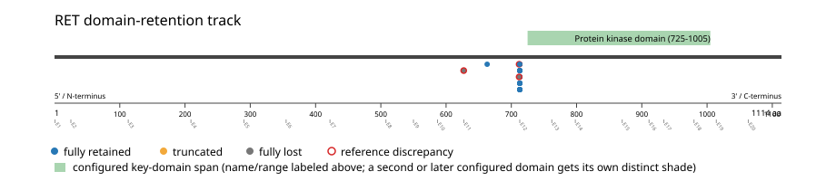
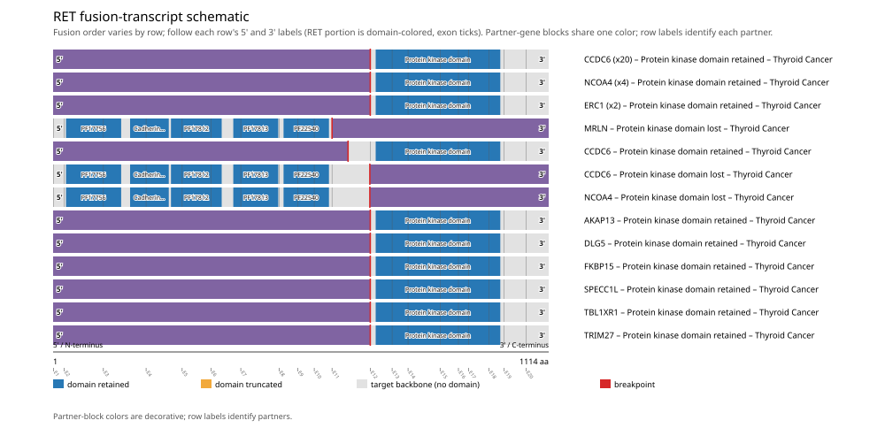
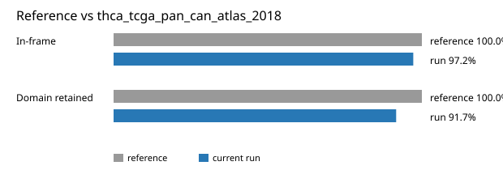

# RET real-data fusion benchmark: thca_tcga_pan_can_atlas_2018

Retrieved from public cBioPortal and Genome Nexus on 2026-09-09.

## Results

- Structural variants returned for RET: 36
- Protein-fusion records found: 36
- Protein-fusion records mapped: 36
- Malformed/unmappable fusion records skipped: 0
- In-frame: 35/36 (97.2%)
- Protein kinase domain (725-1005 aa) retained: 33/36 (91.7%)
- In-frame and Protein kinase domain-retained: 33/35
- Fisher exact test (one-sided): odds ratio unavailable, p=0.0833333
- Breakpoint-permutation empirical p-value: 0.000999001
- Contingency table `[[retained/in-frame, retained/other], [not-retained/in-frame, not-retained/other]]`: `[[33, 0], [2, 1]]`

- Mutation/CNA co-occurrence: not computed (RET has no mutual_exclusivity_targets configured; co-occurrence/mutual-exclusivity analysis was skipped.)

### Domain retention and discrepancies

*Domain-retention positions for analyzed fusion events; red outlines mark reference discrepancies.*

### Fusion-transcript schematic

*One row per recurrent partner/breakpoint group, sharing one amino-acid x-axis for RET's full protein length; the partner-contributed portion is colored per partner, the retained target-gene portion is colored by domain-retention status, and a red line marks the breakpoint.*

## Method

The cBioPortal `thca_tcga_pan_can_atlas_2018_structural_variants` structural-variant profile was queried by the configured Entrez gene ID. Fusion-annotated records were adapted to the production SV schema and normalized; when `site2EffectOnFrame=NA`, frame status was resolved from `Event_Info`, not copied into `FusionEvent.Frame_status`.

RET genomic breakpoints were mapped against the Genome Nexus canonical transcript, and retention was classified against its returned Protein kinase domain coordinates. Counts are event-level with no patient deduplication. The Fisher comparison's `other` column combines out-of-frame and unknown-frame events, as pre-specified by the domain-retention algorithm.

For each fusion, breakpoint selection preferred the Genome Nexus canonical transcript's exon-spanned target locus over cBioPortal site labels; malformed rows with no unambiguous target-locus coordinate were skipped and listed in Warnings.

## Full-suite highlights

- Registered algorithms executed: composite_score, confidence_stats, cutpoint_detection, domain_disruption, domain_retention, exon_retention, expression_association, frequency, joint_partner, mutation_cooccurrence, window_detection
- Cutpoint detection: inferred breakpoint 712 aa (exon 11); corrected permutation p=0.000999001.
- Top composite score: CCDC6 (22 events), 0.471918.
- Expression association: RET mRNA expression is significantly higher in fusion-positive samples (n=33) than fusion-negative samples (n=465) (mann_whitney_u, p=2.12e-21). Among fusion-positive samples, RET expression is not significantly higher in kinase-domain-retained fusions (n=33) than not-retained fusions (n=3) (mann_whitney_u, p=0.71).

## Partners

AKAP13 (1), CCDC6 (22), DLG5 (1), ERC1 (2), FKBP15 (1), MRLN (1), NCOA4 (5), SPECC1L (1), TBL1XR1 (1), TRIM27 (1)

## Reference comparison

| Metric | PMCID: PMC6430196 (KIF5B-RET) | This run |
|---|---:|---:|
| In-frame | 100.0% | 97.2% |
| Domain retained | 100.0% | 91.7% |

*Published reference percentages compared with this run.*

## Interpretation

These values describe the live study named above.
