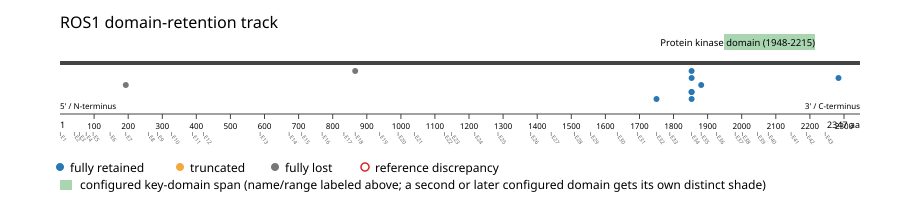
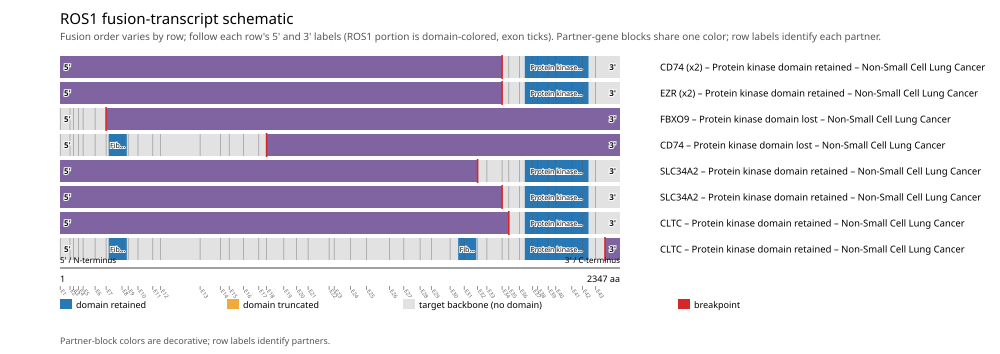

# ROS1 real-data fusion benchmark: luad_tcga_pan_can_atlas_2018

Retrieved from public cBioPortal and Genome Nexus on 2026-09-10.

## Results

- Structural variants returned for ROS1: 10
- Protein-fusion records found: 10
- Protein-fusion records mapped: 10
- Malformed/unmappable fusion records skipped: 0
- In-frame: 8/10 (80.0%)
- Protein kinase domain (1948-2215 aa) retained: 8/10 (80.0%)
- In-frame and Protein kinase domain-retained: 8/8
- Fisher exact test (one-sided): odds ratio unavailable, p=0.0222222
- Breakpoint-permutation empirical p-value: 0.00599401
- Contingency table `[[retained/in-frame, retained/other], [not-retained/in-frame, not-retained/other]]`: `[[8, 0], [0, 2]]`

- Mutation/CNA co-occurrence: not computed (ROS1 has no mutual_exclusivity_targets configured; co-occurrence/mutual-exclusivity analysis was skipped.)

### Domain retention and discrepancies

*Domain-retention positions for analyzed fusion events; red outlines mark reference discrepancies.*

### Fusion-transcript schematic

*One row per recurrent partner/breakpoint group, sharing one amino-acid x-axis for ROS1's full protein length; the partner-contributed portion is colored per partner, the retained target-gene portion is colored by domain-retention status, and a red line marks the breakpoint.*

## Method

The cBioPortal `luad_tcga_pan_can_atlas_2018_structural_variants` structural-variant profile was queried by the configured Entrez gene ID. Fusion-annotated records were adapted to the production SV schema and normalized; when `site2EffectOnFrame=NA`, frame status was resolved from `Event_Info`, not copied into `FusionEvent.Frame_status`.

ROS1 genomic breakpoints were mapped against the Genome Nexus canonical transcript, and retention was classified against its returned Protein kinase domain coordinates. Counts are event-level with no patient deduplication. The Fisher comparison's `other` column combines out-of-frame and unknown-frame events, as pre-specified by the domain-retention algorithm.

For each fusion, breakpoint selection preferred the Genome Nexus canonical transcript's exon-spanned target locus over cBioPortal site labels; malformed rows with no unambiguous target-locus coordinate were skipped and listed in Warnings.

## Full-suite highlights

- Registered algorithms executed: composite_score, confidence_stats, cutpoint_detection, domain_disruption, domain_retention, exon_retention, expression_association, frequency, genomic_position_recurrence, joint_partner, mutation_cooccurrence, window_detection
- Cutpoint detection: inferred breakpoint 866 aa (exon 17/18 boundary); corrected permutation p=0.031968.
- Genomic-position recurrence: All 5 events sharing protein position 1853 aa share the exact same genomic breakpoint -- consistent with a real DNA-level recurrent breakpoint, not just a protein-coordinate coincidence.
- Top composite score: CD74 (3 events), 0.28384.
- Expression association: ROS1 mRNA expression is significantly higher in fusion-positive samples (n=7) than fusion-negative samples (n=503) (mann_whitney_u, p=2.08e-05). Among fusion-positive samples, ROS1 expression is not significantly higher in kinase-domain-retained fusions (n=8) than not-retained fusions (n=2) (mann_whitney_u, p=0.693).

## Partners

CD74 (3), CLTC (2), EZR (2), FBXO9 (1), SLC34A2 (2)

## Interpretation

These values describe the live study named above.
