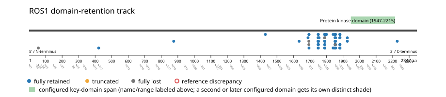
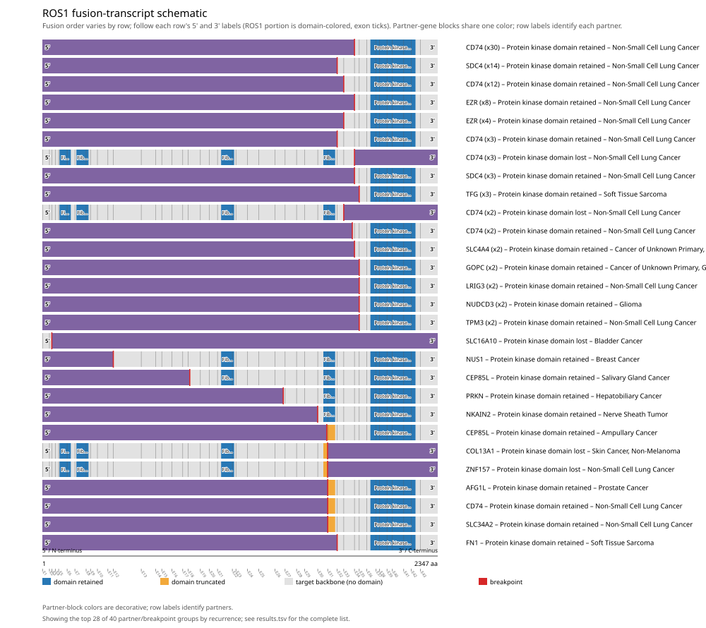
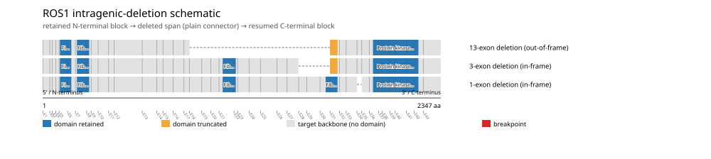

# ROS1 real-data fusion benchmark: msk_impact_50k_2026

Retrieved from public cBioPortal and Genome Nexus on 2026-09-15.

## Results

- Structural variants returned for ROS1: 207
- Protein-fusion records found: 122
- Protein-fusion records mapped: 118
- Malformed/unmappable fusion records skipped: 4
- In-frame among known-frame events: 72/99 (72.7%)
- Unknown frame status: 19/118
- Protein kinase domain (1947-2215 aa) retained: 107/118 (90.7%)
- In-frame and Protein kinase domain-retained: 67/72
- Fisher exact test (one-sided): odds ratio 2.01, p=0.214047
- Breakpoint-permutation empirical p-value: 0.002997
- Contingency table `[[retained/in-frame, retained/other], [not-retained/in-frame, not-retained/other]]`: `[[67, 40], [5, 6]]`

- Mutation/CNA co-occurrence: not computed (ROS1 has no mutual_exclusivity_targets configured; co-occurrence/mutual-exclusivity analysis was skipped.)

### Mechanistic interpretation

**Curated mechanism:** Loss of an autoinhibitory extracellular/ligand-binding domain, with retention of an intact kinase domain -- not primarily partner-driven dimerization the way ALK/RET fusions work. The fusion deletes essentially the entire ROS1 ectodomain (the fibronectin type III repeats, YWTD beta-propellers, and N-terminal CATCH domain) while preserving the juxtamembrane segment, kinase domain, and C-terminal tail, yielding ligand-independent constitutive autophosphorylation. The partner (e.g. CD74, a type II integral membrane protein) contributes a topological role rather than a dimerization motif: because CD74's N-terminus is cytoplasmic, the ROS1-encoded transmembrane segment retained at the breakpoint is what returns the chain to the cytosol so the kinase domain can access its substrates -- positioning, not oligomerization, is what the partner supplies here.

**Protein kinase domain retention:** not statistically significant (p=0.214047, odds ratio=2.01) -- too weak to say what this gene's fusions require, let alone characterize which events run counter to it.

**Fibronectin type III domain disruption:** not statistically significant (p=0.0770779, odds ratio=3.05128) -- too weak to say what this gene's fusions require, let alone characterize which events run counter to it.

### Domain retention and discrepancies

*Domain-retention positions for analyzed fusion events; red outlines mark reference discrepancies.*

### Fusion-transcript schematic

*One row per recurrent partner/breakpoint group, sharing one amino-acid x-axis for ROS1's full protein length; the partner-contributed portion is colored per partner, the retained target-gene portion is colored by domain-retention status, and a red line marks the breakpoint.*

### Intragenic-deletion schematic

*Same-gene (Site1==Site2==ROS1) intragenic-deletion-style SV records: a retained N-terminal block, a plain connector line for the deleted span, and a resumed C-terminal block.*

## Method

The cBioPortal `msk_impact_50k_2026_structural_variants` structural-variant profile was queried by the configured Entrez gene ID. Fusion-annotated records were adapted to the production SV schema and normalized; when `site2EffectOnFrame=NA`, frame status was resolved from `Event_Info`, not copied into `FusionEvent.Frame_status`.

ROS1 genomic breakpoints were mapped against the Genome Nexus canonical transcript, and retention was classified against its returned Protein kinase domain coordinates. Counts are event-level with no patient deduplication. In-frame percentage uses only events explicitly called in-frame or out-of-frame; unknown-frame events are reported separately and excluded from that denominator. The Fisher comparison's `other` column combines out-of-frame and unknown-frame events, as pre-specified by the domain-retention algorithm.

For each fusion, breakpoint selection preferred the Genome Nexus canonical transcript's exon-spanned target locus over cBioPortal site labels; malformed rows with no unambiguous target-locus coordinate were skipped and listed in Warnings.

## Full-suite highlights

- Registered algorithms executed: composite_score, confidence_stats, cutpoint_detection, domain_disruption, domain_retention, exon_retention, expression_association, frequency, genomic_position_recurrence, joint_partner, mechanistic_interpretation, mutation_cooccurrence, window_detection
- Cutpoint detection: inferred breakpoint 1693 aa (exon 30); corrected permutation p=0.0959041.
- Genomic-position recurrence: The 2 events sharing protein position 1693 aa use 2 distinct genomic positions spanning 740 bp -- the protein-position recurrence is broader than any single genomic hotspot, consistent with independent intronic breakpoints mapped (or clamped) onto the same protein/exon boundary rather than one shared DNA lesion.
- Top composite score: CD74 (55 events), 0.447974.
- Expression association: No mRNA expression data was available for ROS1 in this cohort; expression-association analysis was skipped.

## Partners

AFG1L (1), CCDC30 (1), CD74 (55), CEP85L (2), CERT1 (1), COL13A1 (1), EYS (1), EZR (13), FN1 (1), GOLGB1 (1), GOPC (4), GRIK2 (1), IGF1R (1), LARS1 (1), LRIG3 (2), MYH9 (1), NETO1 (1), NKAIN2 (1), NUDCD3 (2), NUS1 (1), PRKN (1), RBPJL (1), SDC4 (17), SLC16A10 (1), SLC34A2 (1), SLC4A4 (2), STX7 (1), TFG (3), TPM3 (2), ZNF157 (1)

## Warnings

- Skipped EVT-P-0016175-T01-IM6-32 (EYS-ROS1): ValueError: could not determine 5'/3' role for ROS1 in EVT-P-0016175-T01-IM6-32; Event_Info='Antisense Fusion'
- Skipped EVT-P-0010101-T01-IM5-48 (NETO1-ROS1): ValueError: could not determine 5'/3' role for ROS1 in EVT-P-0010101-T01-IM5-48; Event_Info='Antisense fusion'
- Skipped EVT-P-0021671-T01-IM6-85 (ROS1-CD74): ValueError: could not determine 5'/3' role for ROS1 in EVT-P-0021671-T01-IM6-85; Event_Info='Antisense Fusion'
- Skipped EVT-P-0006237-T04-IM6-89 (ROS1-CERT1): ValueError: could not determine 5'/3' role for ROS1 in EVT-P-0006237-T04-IM6-89; Event_Info='Antisense Fusion'

## Interpretation

These values describe the live study named above.
